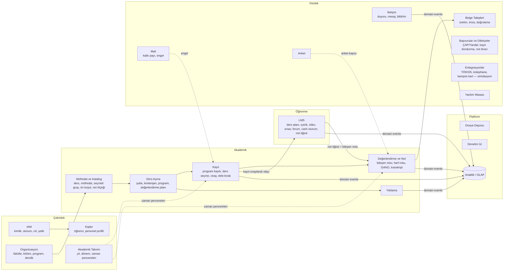

# 02 · Ürün Kapsamı ve Modül Haritası

> **Durum:** Taslak v0.1 · Girdi: [01 · Mevcut Sistem Keşfi](../analiz/01-mevcut-sistem-kesfi.md)

## 1. Vizyon

**Agora**, OBS (öğrenci bilgi sistemi) ile e-Kampüs'ü (öğrenme yönetim sistemi) tek bir alan modeli, tek bir kimlik ve tek bir arayüz altında birleştirir. Bir dersin kataloğu, açılması, kaydı, içeriği, ödevi, notu, yoklaması ve analitiği aynı sistemde ve birbirine bağlı yaşar. Hiçbir veri iki kez girilmez, hiçbir senkronizasyon gecikmesi olmaz.

**Tasarım ilkeleri**

1. **Tek kaynak (single source of truth)**: Her bilgi tek yerde tutulur. LMS notu = değerlendirme bileşeni notu.
2. **Kurallar kodda**: Yönetmelik ve takvim kuralları çalışan, test edilen kuraldır, metin değildir.
3. **Varsayılan olarak güvenli**: En az yetki, kapsamlı yetkilendirme, denetim izi, KVKK.
4. **Gözlemlenebilir**: Her istek ölçülür, izlenir ve loglanır.
5. **Ölçeklenebilir**: ~92 bin öğrencinin ders seçme açılışına dayanacak şekilde tasarlanır ve test edilir.

## 2. Personalar

| Persona | Temel ihtiyaç | Bugünkü acı noktası |
| --- | --- | --- |
| **Öğrenci** | Dersini seç, içeriğe ulaş, ödev teslim et, notunu ve transkriptini gör, belge al | İki sistem, gecikmeli senkron, kurallar sonradan hata veriyor |
| **Öğretim elemanı** | Şubesini yönet, içerik/ödev/sınav oluştur, not ve yoklama gir | Notları iki kez giriyor, canlı ders linkini forumla paylaşıyor |
| **Danışman** | Danışmanlığındaki öğrencilerin ders seçimini onayla, riskli öğrenciyi fark et | Kural kontrolü elle, erken uyarı yok |
| **Bölüm başkanı** | Ders açma, kontenjan, ekle-bırak onayı, bölüm başarı analitiği | Raporlama zayıf |
| **Fakülte öğrenci işleri** | Öğrenci kayıtları, müfredat eşleştirme, not düzeltme, belge onayı | Manuel eşleştirme, dağınık talepler |
| **Öğrenci İşleri Daire Başkanlığı (OİDB)** | Akademik takvim, dönemler, not ölçeği, yönetmelik parametreleri | Takvim metin olarak yayınlanıyor |
| **Mali işler (katkı payı)** | Borç ve engel (hold) yönetimi | Ayrı sistem |
| **Dekanlık / Rektörlük** | Üst düzey analitik paneller | Analitik yok |
| **Sistem yöneticisi (BİDB)** | Kullanıcı ve rol yönetimi, denetim, sistem sağlığı | — |

## 3. Modül (Bounded Context) Haritası

## 4. Modül Bazlı Özellik Listesi

Öncelik: **P0** = MVP (bitirme projesi teslimi için şart) · **P1** = güçlü katkı · **P2** = zaman kalırsa.

### 4.1 IAM — Kimlik ve Erişim
| Özellik | Öncelik |
| --- | --- |
| Kullanıcı adı (öğrenci/personel no) + şifre ile giriş, argon2id | P0 |
| Kısa ömürlü access token + dönen (rotating) refresh token, yeniden kullanım tespiti | P0 |
| Rol + kapsam (scope) bazlı yetkilendirme, ilişki tabanlı kontroller (danışman↔öğrenci, eğitmen↔şube) | P0 |
| Şifre sıfırlama (e-posta token) | P0 |
| Brute-force koruması (IP + kullanıcı bazlı rate limit, artan bekleme) | P0 |
| Aktif oturumlar/cihazlar listesi ve uzaktan oturum sonlandırma | P1 |
| TOTP tabanlı MFA (personel için zorunlu, öğrenci için isteğe bağlı) + kurtarma kodları | P1 |
| Mobil için QR ile oturum açma (web'de QR, mobilde tara) | P2 |
| Passkey / WebAuthn | P2 |

### 4.2 Organizasyon ve Kişiler
| Özellik | Öncelik |
| --- | --- |
| Üniversite → Fakülte/Birim → Bölüm → Program hiyerarşisi (önlisans/lisans/YL/doktora, dil, N.Ö./İ.Ö.) | P0 |
| Kampüs → Bina → Derslik (kapasite, tür) | P0 |
| Öğrenci ve personel profilleri (unvan, ofis, görüşme saatleri) | P0 |
| Danışman atama (geçmişiyle) | P0 |
| Danışman randevu sistemi | P2 |

### 4.3 Akademik Takvim
| Özellik | Öncelik |
| --- | --- |
| Akademik yıl, dönem (Güz/Bahar/Yaz) | P0 |
| Takvim olayları = tipli **zaman pencereleri** (ders seçme, danışman onayı, ekle-bırak, not girişleri, sınav dönemleri, tatiller), üniversite/fakülte kapsamı | P0 |
| Pencere açılış/kapanış hatırlatmaları (bildirim) | P1 |
| iCal dışa aktarma | P2 |

### 4.4 Müfredat ve Katalog
| Özellik | Öncelik |
| --- | --- |
| Ders kataloğu (kod, TR/EN ad, T/U/K/AKTS, dil, açıklama, öğrenme çıktıları) | P0 |
| Versiyonlu müfredat (programa + giriş yılına bağlı), yarıyıl yerleşimi | P0 |
| Seçmeli gruplar ve ders havuzları (teknik seçmeli, üniversite alan dışı, formasyon) | P0 |
| Ön koşul ve eşdeğerlik tanımları | P1 |
| Not ölçeği (harf, katsayı, aralık, GPA'ya etkisi) | P0 |

### 4.5 Ders Açma
| Özellik | Öncelik |
| --- | --- |
| Dönem bazında ders açma, şube oluşturma | P0 |
| Şube kontenjanı + bölüm/program bazlı alt kontenjan | P0 |
| Şube–öğretim elemanı ataması | P0 |
| Haftalık program (gün, saat, derslik, teori/uygulama) ve **çakışma kontrolü** (derslik + eğitmen) | P0 |
| Şube değerlendirme planı (bileşenler + ağırlık, toplam %100, bütünleme = final) | P0 |
| Sınav takvimi (tarih, salon, gözetmen) | P1 |

### 4.6 Kayıt (Ders Seçme)
| Özellik | Öncelik |
| --- | --- |
| Program kaydı (anadal/ÇAP/yandal, kayıt tipi, durum: aktif/dondurulmuş/mezun/ilişik kesilmiş) + aktif program bağlamı | P0 |
| Alınabilir ders listesi (başarısız/başarılı/hiç alınmamış), müfredata göre | P0 |
| Sepet (taslak) → danışman onayına gönder → onay/red. Red taslağa geri döndürür | P0 |
| Anlık kural doğrulama: AKTS limiti (GANO'ya göre), 1. sınıf zorunlu dersler, alttan ders önceliği, ön koşul, program çakışması, kontenjan, engel (katkı payı/disiplin), azami süre 5 ders kuralı | P0 |
| Yarış durumuna dayanıklı kontenjan düşümü (atomik koşullu güncelleme) | P0 |
| Ekle-bırak (danışman + bölüm başkanı onayı) | P1 |
| Takvim görünümünde seçim önizleme | P1 |
| Kayıt onay raporu (PDF) | P1 |
| Bekleme listesi (kontenjan açılınca sıradakine teklif) | P2 |

### 4.7 Değerlendirme ve Not
| Özellik | Öncelik |
| --- | --- |
| Bileşen notu girişi (takvim penceresi + şube eğitmeni kontrolü), "girmedi" işareti | P0 |
| Ağırlıklı ortalama → harf notu (otomatik + elle harf notu atama penceresi) | P0 |
| Not ilanı (yayın tarihi), sınıf ortalaması, dağılım | P0 |
| Bütünleme akışı (final yerine geçer) | P0 |
| YANO/GANO hesaplama, tekrar alınan derste **son not geçerli** | P0 |
| Transkript (ekran + PDF), sanal transkript / "ne olur" simülatörü | P0 |
| Not düzeltme talebi (onay iş akışı + denetim izi) | P1 |
| F1 (devamsızlık) otomatik önerisi | P1 |

### 4.8 Yoklama
| Özellik | Öncelik |
| --- | --- |
| Şube oturumları (programdan otomatik üretim) | P1 |
| Manuel yoklama girişi | P1 |
| Öğrencinin kendi devamsızlık raporu + eşik uyarısı | P1 |
| Dönen QR kod ile yoklama (mobil) | P2 |

### 4.9 LMS (e-Kampüs'ün karşılığı)
| Özellik | Öncelik |
| --- | --- |
| Şube başına ders alanı (kayıt onayında otomatik üyelik) | P0 |
| Konu/hafta bölümleri, sıralama, görünürlük ve erişim zamanları | P0 |
| Etkinlik türleri: dosya, klasör, link, sayfa, ödev, forum | P0 |
| Ödev: açılış/son tarih/kesin kapanış, deneme hakkı, dosya türü/boyut sınırları, teslim, geç teslim, puanlama + geri bildirim | P0 |
| **Not öğesi ↔ değerlendirme bileşeni bağlantısı** (ödev puanı vizeye/projeye akar) | P0 |
| Etkinlik tamamlama + ders ilerleme % | P1 |
| Sınav (quiz): soru bankası (çoktan seçmeli/doğru-yanlış/kısa cevap/klasik), süre, deneme, karıştırma, otomatik puanlama | P1 |
| Canlı oturum (Meet/Zoom/BBB linki, programdan otomatik takvim) | P1 |
| Zaman çizelgesi (yaklaşan teslimler) | P0 |
| Rozetler, blog, öğrenme planları | P2 |

### 4.10 İletişim
| Özellik | Öncelik |
| --- | --- |
| Duyurular: hedef kapsam (üniversite/fakülte/bölüm/program/şube/rol), yayın penceresi, okundu bilgisi | P0 |
| Bildirim merkezi (uygulama içi), olay türü × kanal tercih matrisi | P0 |
| E-posta bildirimleri (outbox + worker) | P1 |
| Mobil push (Expo push) | P1 (mobil fazında) |
| Gerçek zamanlı bildirim akışı (SSE/WebSocket) | P1 |
| Birebir ve grup mesajlaşma (şube grubu) | P1 |

### 4.11 Anket
| Özellik | Öncelik |
| --- | --- |
| Ders değerlendirme anketi (şube bazlı, dönem sonu) | P1 |
| **Anonimlik garantisi**: yanıt ile kimlik ayrı tablolarda, sadece "tamamladı" bayrağı kimlikle bağlı | P1 |
| Anket kapısı: anket doldurulmadan harf notu gösterilmez (konfigüre edilebilir) | P1 |
| Eğitmene yalnızca not ilanından sonra ve en az N yanıtla toplu sonuç | P1 |

### 4.12 Belge Talepleri
| Özellik | Öncelik |
| --- | --- |
| Öğrenci belgesi / transkript talebi (dil, sebep varyantları) | P1 |
| Otomatik PDF üretimi + dijital imza (simülasyon) + **doğrulama kodu ve QR** | P1 |
| Halka açık belge doğrulama sayfası | P1 |

### 4.13 Başvurular ve Dilekçeler
| Özellik | Öncelik |
| --- | --- |
| ÇAP/Yandal başvuru → yerleştirme → öğrenci onayı | P2 |
| Genel dilekçe iş akışı (kayıt dondurma, muafiyet, not itirazı) — durum makinesi | P2 |

### 4.14 Mali ve Entegrasyonlar
| Özellik | Öncelik |
| --- | --- |
| Katkı payı borcu → kayıt engeli (hold) | P1 |
| YÖKSİS gönderimi (simülasyon, günde 1 kuralı, detaylı hata log'u) | P2 |
| Kütüphane / kampüs kart (simülasyon) | P2 |

### 4.15 Platform
| Özellik | Öncelik |
| --- | --- |
| Dosya deposu (S3 uyumlu — MinIO), imzalı URL, boyut/tür doğrulama | P0 |
| Denetim izi (kim, neyi, ne zaman, önce/sonra) | P0 |
| Kullanıcı tercihleri: dil, tema, dashboard widget'ları, favoriler | P1 |
| Yardım masası (talep + mesajlaşma) | P2 |
| Global arama (ders, kişi, içerik) | P2 |

### 4.16 Analitik (OLAP)
| Özellik | Öncelik |
| --- | --- |
| Veri ambarı (yıldız şema) + artımlı ETL | P0 |
| Ders/şube başarı ve not dağılımı, kontenjan doluluğu, kayıt hunisi | P0 |
| Danışman risk paneli (erken uyarı) | P1 |
| LMS etkileşimi ↔ başarı korelasyonu | P1 |
| Grafana iş panelleri + uygulama içi paneller | P1 |

## 5. Fonksiyonel Olmayan Gereksinimler

| Alan | Hedef |
| --- | --- |
| **Performans** | Okuma uç noktalarında p95 < 200 ms, yazmada p95 < 400 ms (normal yük) |
| **Ölçek / Yük** | Ders seçme açılışı: ~10.000 eşzamanlı öğrenci, dakikada on binlerce istek, **sıfır kontenjan aşımı** |
| **Erişilebilirlik (uptime)** | Hedef SLO %99,5 (demo ortamı için ölçülür, raporlanır) |
| **Güvenlik** | OWASP ASVS L2 hedefleri, OWASP Top 10 kontrolleri, bağımlılık taraması |
| **KVKK** | PII sınıflandırma, TC Kimlik No uygulama seviyesinde şifreli, log'larda maskeleme, veri saklama süreleri, analitikte takma adlandırma |
| **Gözlemlenebilirlik** | RED metrikleri (Rate/Errors/Duration), yapılandırılmış log (JSON), istek kimliği, isteğe bağlı dağıtık izleme |
| **i18n** | TR (varsayılan) + EN. Eksik çeviri anahtarı CI'da hata verir |
| **a11y** | WCAG 2.2 AA hedefi (klavye, kontrast, ekran okuyucu) |
| **Tarayıcı / cihaz** | Güncel evergreen tarayıcılar, 360 px'ten itibaren responsive |
| **Test** | Backend: birim + entegrasyon (gerçek PostgreSQL ile). Web: bileşen + e2e (Playwright). Yük: k6 senaryoları |

## 6. Kapsam Dışı (bilinçli olarak)

- Lisansüstü tez süreçleri, Erasmus/değişim, yatay geçiş başvuru iş akışının tamamı.
- Gerçek e-Devlet / YÖKSİS / banka entegrasyonları (yalnızca **simülasyon** adaptörleri).
- Gerçek nitelikli elektronik imza (PAdES). Bunun yerine sunucu anahtarıyla imza + doğrulama kodu.
- İnsan kaynakları, maaş, satın alma gibi idari modüller.
