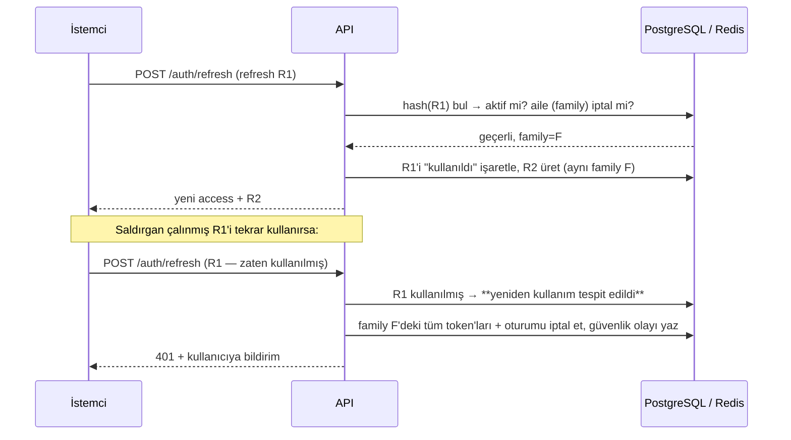

# 03 · Kimlik Doğrulama (AuthN) ve Yetkilendirme (AuthZ)

> **Durum:** Taslak v0.1 · İlgili: [02 · Kapsam](02-urun-kapsami-ve-moduller.md), [04 · Veri Modeli](04-veri-modeli-oltp.md)

## 1. Tehdit Modeli (özet)

| Varlık | Değer | Başlıca tehdit |
| --- | --- | --- |
| Notlar, transkript | Çok yüksek (bütünlük) | Yetkisiz not değişikliği, eğitmen hesabının ele geçirilmesi |
| Ders kaydı / kontenjan | Yüksek (adalet) | Bot ile kontenjan kapma, yarış durumu (race condition) ile kontenjan aşımı |
| Kişisel veriler (TC No, iletişim) | Yüksek (gizlilik, KVKK) | Veri sızıntısı, IDOR (başkasının kaydını ID ile okuma) |
| Oturum / token | Yüksek | Token çalınması, refresh token yeniden kullanımı, XSS ile token sızdırma |
| Belgeler | Orta-yüksek | Sahte belge üretimi → doğrulama kodu ve imza ile önlenir |
| Erişilebilirlik | Yüksek (kayıt döneminde) | Ders seçme açılışında DoS benzeri yük → rate limit, kapasite testi |

**Temel savunmalar:** güçlü parola hash'i, kısa ömürlü token, dönen refresh token ve yeniden kullanım tespiti, MFA, rate limit, kapsam + ilişki + zaman bazlı yetkilendirme, her yazma işleminde denetim izi, nesne seviyesinde yetki kontrolü (IDOR'a karşı), girdi doğrulama, güvenlik başlıkları.

---

## 2. Kimlik Modeli

- **`iam.users`**: oturum açabilen hesap (kullanıcı adı, e-posta, durum, MFA bilgisi).
- **`people.persons`**: gerçek kişi (ad, soyad, TC No şifreli, doğum tarihi …). `users.person_id` ile bağlı.
- Bir kişi **aynı anda** öğrenci ve personel olabilir (ör. araştırma görevlisi + doktora öğrencisi). Bu yüzden rol "kullanıcı tipi" değil, **atama**dır.
- Kullanıcı adı: öğrenci için **öğrenci numarası**, personel için **personel numarası**. E-posta ile de giriş yapılabilir (normalize edilmiş, büyük-küçük harf duyarsız).

---

## 3. Kimlik Doğrulama (AuthN)

### 3.1 Parola

| Konu | Karar |
| --- | --- |
| Hash | **argon2id** (`golang.org/x/crypto/argon2`). Başlangıç parametreleri: m = 64 MiB, t = 3, p = 2, 16 byte salt, 32 byte anahtar. Parametreler hash string'inde saklanır (PHC formatı) ve sonradan yükseltilebilir (girişte yeniden hash'leme) |
| Politika | NIST SP 800-63B: en az 10 karakter, en fazla 128. Karmaşıklık zorlaması yok ama **yaygın/sızmış parola listesi** kontrolü var. Periyodik zorunlu değişim yok |
| Karşılaştırma | Sabit zamanlı (`crypto/subtle`). Kullanıcı yoksa da sahte hash doğrulaması yapılır (kullanıcı adı numaralandırmasına karşı zamanlama dengesi) |
| İlk giriş | Seed/öğrenci işleri tarafından oluşturulan hesaplar `must_change_password = true` ile başlar |

### 3.2 Token stratejisi

```text
┌─────────────┐   POST /auth/login (kullanıcı adı + parola [+ MFA])
│   İstemci   │ ───────────────────────────────────────────────▶  API
│ (web/mobil) │ ◀───────────────────────────────────────────────
└─────────────┘   access_token (JWT, 15 dk) + refresh_token (opak, tek kullanımlık, döner)
```

| Token | Biçim | Ömür | Saklama (web) | Saklama (mobil) |
| --- | --- | --- | --- | --- |
| **Access token** | JWT, **EdDSA (Ed25519)** imzalı | 15 dk | **Sadece bellekte** (Redux state). localStorage **yok** | Bellekte |
| **Refresh token** | 256-bit rastgele, opak. DB'de **SHA-256 hash'i** saklanır | 2 saat boşta kalma (her refresh'te yeniden başlar), oturum başına en çok 30 gün mutlak | `HttpOnly; Secure; SameSite=Strict; Path=/api/v1/auth` çerez | `expo-secure-store` (Keychain/Keystore) |

**Access token claim'leri** (küçük tutulur, yetkiler token'a gömülmez):

```json
{
  "iss": "agora", "aud": "agora-api",
  "sub": "<user uuid>", "sid": "<session uuid>",
  "iat": 1791000000, "exp": 1791000900, "jti": "<uuid>",
  "amr": ["pwd", "otp"]
}
```

> Yetkiler token'a konmaz, çünkü rol değişikliği anında etkili olmalı. Yetkiler sunucuda çözülür ve Redis'te önbelleklenir (bkz. §4.6).

**Anahtar yönetimi:** İmza anahtarları `kid` ile tanımlanır. Rotasyon sırasında eski açık anahtar, eski token'ların ömrü dolana kadar doğrulamada kalır. `/.well-known/jwks.json` açık anahtarları yayınlar.

### 3.3 Refresh token rotasyonu ve yeniden kullanım tespiti



- Eşzamanlı sekmelerden gelen meşru yarışları tolere etmek için kısa bir **tolerans penceresi** (10 sn) var: bu süre içinde aynı R1 ile gelen ikinci istek reddedilir ama oturum **sonlandırılmaz**, istemci elindeki yeni token'la devam eder. R2'yi tekrar vermek mümkün değil, çünkü sunucu token'ların sadece hash'ini saklar.
- Aynı token'la eşzamanlı gelen istekler `SELECT ... FOR UPDATE` ile sıraya girer: sadece biri rotasyonu tamamlar.

### 3.4 Oturumlar

- `iam.sessions`: her giriş bir oturum. Cihaz bilgisi (user-agent'tan ayrıştırılmış), IP, oluşturulma ve son görülme zamanı, iptal zamanı tutulur.
- **Boşta kalma zaman aşımı**: 120 dk refresh yapılmazsa oturum düşer (OBS ile uyumlu). **Mutlak ömür**: 30 gün, refresh'lerle uzamaz. Mobil istemci için daha uzun boşta kalma süresi mobil fazında değerlendirilecek. Değerler `AGORA_SESSION_IDLE_TIMEOUT` ve `AGORA_SESSION_ABSOLUTE_TIMEOUT` ile ayarlanır.
- Kullanıcı "Aktif oturumlarım" ekranından tek tek ya da toplu oturum kapatabilir.
- Access token doğrulamasında `sid` iptal edilmiş mi diye bakılır: Redis'te `revoked_sid:{sid}` kaydı access token ömrü (15 dk) boyunca tutulur. Böylece iptal anında etkili olur, ama her istekte DB'ye gidilmez.

### 3.5 MFA (TOTP)

- RFC 6238, 30 sn adım, 6 hane, ±1 adım tolerans. Aynı kodun tekrar kullanımı engellenir (son kullanılan adım saklanır).
- TOTP sırrı DB'de **şifreli** (AES-256-GCM, uygulama anahtarı) saklanır.
- **Zorunluluk politikası**: not girme, kayıt geçersiz kılma, rol atama gibi hassas yetkilere sahip roller için zorunlu. Öğrenci için isteğe bağlı.
- 10 adet tek kullanımlık **kurtarma kodu** (hash'li saklanır).
- Akış: parola doğru + MFA gerekli → kısa ömürlü `mfa_challenge` token (5 dk) → `POST /auth/mfa/verify`.

### 3.6 Şifre sıfırlama

- `POST /auth/password/forgot` her zaman aynı yanıtı döner (hesap var ya da yok, numaralandırmayı önlemek için).
- Token: 256-bit rastgele, DB'de hash'i, **30 dk** geçerli, tek kullanımlık. Kullanılınca kullanıcının **tüm oturumları iptal edilir**.
- E-posta outbox üzerinden gönderilir (geliştirmede Mailpit).

### 3.7 Brute-force ve kötüye kullanım koruması

| Katman | Kural (başlangıç değerleri) |
| --- | --- |
| IP bazlı | `/auth/login`: IP başına 20 istek/dk (Redis, kayan pencere, `AGORA_LOGIN_RATE_LIMIT`). IPv6'da tek adres değil /64 ağı sayılır. Kampüs ağı tek bir NAT IP'sinin arkasındaysa ders seçme gibi yoğun dönemlerde sınır yükseltilmelidir |
| Hesap bazlı | 5 başarısız denemeden sonra artan bekleme (1, 2, 4, 8 … dk, üst sınır 1 saat). Kalıcı kilit yok (DoS'a açık olur) |
| Genel API | Kullanıcı başına token bucket (ör. 20 istek/sn patlama, 5/sn sürekli). Ders seçme uç noktaları için ayrı ve daha sıkı kova |
| Bildirim | Şüpheli giriş (yeni cihaz/IP, çok sayıda başarısız deneme) → kullanıcıya bildirim |

**Redis'e ulaşılamazsa:**

| Kontrol | Davranış | Gerekçe |
| --- | --- | --- |
| Oturum iptal listesi (`revoked_sid`) | **Fail closed**: korumalı istekler 503 alır | Tek savunma hattı. Kesinti boyunca iptal edilmiş oturumların çalışması kabul edilemez |
| Giriş hız sınırı | **Fail open**: istek geçer, hata log'a yazılır | Hesap bazlı kilitleme veritabanında çalışmaya devam eder. Kesintinin tüm girişleri durdurması daha büyük zarar |

Redis `/readyz` kontrolüne dahildir: kesinti sırasında instance trafik almaz.

### 3.8 Web güvenliği

- **CORS**: sadece izinli origin'ler (web uygulaması). Credential'lı istekler yalnızca bu origin'den.
- **CSRF**: refresh çerezi `SameSite=Strict` + refresh uç noktası özel başlık ister (`X-Agora-Client: web`). Diğer uç noktalar `Authorization: Bearer` kullandığı için CSRF'e açık değil.
- **Güvenlik başlıkları**: `Content-Security-Policy` (sıkı, nonce'lu), `Strict-Transport-Security`, `X-Content-Type-Options: nosniff`, `Referrer-Policy: strict-origin-when-cross-origin`, `frame-ancestors 'none'`.
- **XSS**: React varsayılan kaçışlama. Zengin metin (duyuru, ödev açıklaması) sunucuda **izinli liste tabanlı HTML temizleme** ile saklanır.

---

## 4. Yetkilendirme (AuthZ)

### 4.1 Model: RBAC + Kapsam + İlişki + Bağlam

Tek başına RBAC üniversite için yetmez. "Öğretim elemanı not girebilir" doğru ama eksik bir ifade. Doğrusu: **"Bu şubenin eğitmeniyse, final not giriş penceresi açıksa ve notlar kesinleşmemişse girebilir."** Bu yüzden dört katmanlı bir model kullanıyoruz:

| Katman | Soru | Örnek |
| --- | --- | --- |
| **1. Rol → Yetki (RBAC)** | Bu rol bu eylemi yapabilir mi? | `INSTRUCTOR` → `grade:enter` |
| **2. Kapsam (scope)** | Hangi organizasyon birimi üzerinde? | Bölüm başkanı → sadece kendi bölümü |
| **3. İlişki (relationship)** | Kaynakla aktör arasında gerekli bağ var mı? | Eğitmen ↔ şube, danışman ↔ öğrenci, öğrenci ↔ kendi kaydı |
| **4. Bağlam (context)** | Şu an, bu durumda izin var mı? | Takvim penceresi açık mı, kayıt durumu uygun mu, notlar kesinleşmiş mi |

Karar = **1 ∧ 2 ∧ 3 ∧ 4**. Herhangi biri hayırsa → `403 Forbidden` (ve kaynak varlığını sızdırmamak gerekiyorsa `404`).

### 4.2 Roller

| Rol kodu | Ad | Kapsam türü | Not |
| --- | --- | --- | --- |
| `STUDENT` | Öğrenci | program kaydı (örtük) | Her aktif `student_program` için örtük |
| `INSTRUCTOR` | Öğretim Elemanı | bölüm | Şube yetkisi ilişkiden gelir (`section_instructors`) |
| `ADVISOR` | Danışman | bölüm | Öğrenci yetkisi ilişkiden gelir (`advisor_assignments`) |
| `DEPARTMENT_HEAD` | Bölüm Başkanı | bölüm | Ders açma, kontenjan, ekle-bırak onayı, bölüm analitiği |
| `FACULTY_REGISTRAR` | Fakülte Öğrenci İşleri | fakülte | Öğrenci kayıtları, müfredat eşleştirme, not düzeltme onayı, belge işlemleri |
| `FACULTY_DEAN` | Dekan / Dekan Yrd. | fakülte | Fakülte analitiği, üst onaylar |
| `CENTRAL_REGISTRAR` | Öğrenci İşleri Daire Bşk. | üniversite | Takvim, dönem, not ölçeği, yönetmelik parametreleri |
| `FINANCE_OFFICER` | Mali İşler | üniversite | Katkı payı, engeller |
| `RECTORATE_VIEWER` | Rektörlük (salt okuma) | üniversite | Üniversite geneli analitik |
| `SYSTEM_ADMIN` | Sistem Yöneticisi | üniversite | Kullanıcı, rol, sistem ayarları. **Akademik veriyi değiştiremez** (görevler ayrılığı) |
| `AUDITOR` | Denetçi | üniversite | Denetim izi ve güvenlik olaylarını salt okuma |

Rol atamaları **zaman sınırlı** olabilir (`valid_from`, `valid_until`). Bölüm başkanlığı dönemsel bir görevdir.

### 4.3 Yetki kataloğu (`kaynak:eylem`)

```text
iam            user:read  user:manage  role:assign  session:manage_own  audit:read
org            org:read  org:manage  classroom:manage
people         profile:read_own  profile:update_own  person:read  person:manage  advisor:assign
calendar       calendar:read  calendar:manage
curriculum     course:read  course:manage  curriculum:read  curriculum:manage  gradescale:manage
offering       offering:manage  section:manage  schedule:manage  quota:manage  assessment_plan:manage
registration   registration:manage_own  registration:approve  registration:approve_add_drop
               registration:override  student_program:manage  hold:manage
grading        score:enter  grade:finalize  grade:read_own  grade:read_section  grade:read_scoped
               grade_change:request  grade_change:approve  transcript:read_own  transcript:read_scoped
attendance     attendance:take  attendance:read_own  attendance:read_section
lms            lms:read_enrolled  lms:content_manage  lms:submit_own  lms:grade_submissions  quiz:manage
communication  announcement:read  announcement:publish  message:send  notification:read_own
survey         survey:respond_own  survey:manage  survey:results_read
documents      document:request_own  document:process  document:verify_public
applications   application:submit_own  application:review
analytics      analytics:read_scoped
helpdesk       ticket:create_own  ticket:handle
```

### 4.4 Rol → yetki matrisi (özet)

| Yetki | STU | INS | ADV | DH | F-REG | DEAN | C-REG | FIN | ADMIN |
| --- | :-: | :-: | :-: | :-: | :-: | :-: | :-: | :-: | :-: |
| `registration:manage_own` | ✅ | | | | | | | | |
| `registration:approve` | | | ✅ | | | | | | |
| `registration:approve_add_drop` | | | | ✅ | | | | | |
| `registration:override` | | | | | ✅ | | ✅ | | |
| `offering:manage` / `quota:manage` | | | | ✅ | ✅ | | | | |
| `assessment_plan:manage` | | ✅ | | | | | | | |
| `score:enter` / `grade:finalize` | | ✅ | | | | | | | |
| `grade:read_own` / `transcript:read_own` | ✅ | | | | | | | | |
| `grade:read_section` | | ✅ | | | | | | | |
| `transcript:read_scoped` | | | ✅ | ✅ | ✅ | ✅ | ✅ | | |
| `grade_change:approve` | | | | ✅ | ✅ | | | | |
| `lms:content_manage` / `lms:grade_submissions` | | ✅ | | | | | | | |
| `lms:submit_own` | ✅ | | | | | | | | |
| `announcement:publish` | | ✅ | | ✅ | ✅ | ✅ | ✅ | | |
| `calendar:manage` / `gradescale:manage` | | | | | | | ✅ | | |
| `hold:manage` | | | | | ✅ | | | ✅ | |
| `analytics:read_scoped` | | ✅ | ✅ | ✅ | ✅ | ✅ | ✅ | | |
| `user:manage` / `role:assign` | | | | | | | | | ✅ |
| `audit:read` | | | | | | | | | ✅ (+AUDITOR) |

> Matris DB'de veri olarak tutulur (`iam.role_permissions`). Kod içinde hard-code edilmez. Seed migration ile başlangıç değerleri yüklenir.

### 4.5 İlişki ve bağlam kuralları (politika fonksiyonları)

Her hassas eylem, servis katmanında açıkça isimlendirilmiş bir **politika fonksiyonu** ile korunur. Örnekler (dil bağımsız sözde kod):

```text
canEnterScore(actor, assessment, now):
    has(actor, "score:enter")
    AND isInstructorOf(actor, assessment.section)                  # ilişki
    AND calendarWindowOpen(windowFor(assessment.category),          # bağlam: ara sınav / final / bütünleme
                           scope = assessment.section.faculty, now)
    AND assessment.section.grades_finalized_at IS NULL              # bağlam: kesinleşmemiş

canApproveRegistration(actor, registration, now):
    has(actor, "registration:approve")
    AND isCurrentAdvisorOf(actor, registration.student_program)     # ilişki
    AND registration.status = 'SUBMITTED'                           # durum makinesi
    AND calendarWindowOpen('ADVISOR_APPROVAL', scope = faculty, now)

canEditRegistration(actor, registration, now):
    has(actor, "registration:manage_own")
    AND registration.student_program.student.user_id = actor.id      # sahiplik
    AND registration.status IN ('DRAFT', 'REJECTED')
    AND calendarWindowOpen('COURSE_REGISTRATION' | 'ADD_DROP', ...)
    AND NOT hasActiveHold(student_program, blocks = 'REGISTRATION')

canReadTranscript(actor, studentProgram):
    (has(actor, "transcript:read_own") AND owns(actor, studentProgram))
    OR (has(actor, "transcript:read_scoped") AND (
          inScope(actor, studentProgram.program.department)         # kapsam
          OR isCurrentAdvisorOf(actor, studentProgram)))            # ilişki

canApproveGradeChange(actor, request):
    has(actor, "grade_change:approve")
    AND inScope(actor, request.section.department)
    AND request.requested_by != actor.id                             # görevler ayrılığı
```

### 4.6 Uygulama mimarisi (enforcement)

```text
HTTP isteği
  │
  ├─ 1. AuthN middleware ── JWT doğrula (imza, exp, aud, iss) → sid iptal mi? (Redis)
  │                         → ctx'e Principal{userID, sessionID} koy
  ├─ 2. Rate limit middleware
  ├─ 3. Route guard ─────── uç nokta için gereken kaba yetki: has(principal, "x:y")
  │                         (yetkiler Redis'te önbellekli: perms:{userID}:{permVersion})
  ├─ 4. Handler ─────────── girdi doğrulama → servis çağrısı
  ├─ 5. Servis + Politika ─ ince taneli karar: canXxx(actor, kaynak, now)
  ├─ 6. Repository ──────── kapsamlı sorgular (WHERE department_id = ANY($scopes))
  └─ 7. (İsteğe bağlı) PostgreSQL RLS ── en hassas tablolarda derinlemesine savunma
```

- **Yetki çözümleme**: `user → aktif rol atamaları → rol yetkileri + kapsamlar` tek sorguyla hesaplanır ve Redis'e yazılır. Rol atamasında değişiklik olunca kullanıcının `perm_version` değeri artırılır ve önbellek doğal olarak geçersizleşir.
- **IDOR koruması**: Kaynağı ID ile getiren her sorgu, aktörün o kaynağa erişim hakkını da sorgulamalıdır. "Önce getir, sonra kontrol et" değil, mümkün olduğunda **"yetkili kümeden getir"**.
- **Varsayılan ret (deny by default)**: Guard tanımlanmamış bir route derleme ya da test aşamasında hata verir (route kayıt tablosunda yetki alanı zorunlu).
  - Uygulama: bütün route'lar `authz.Router` üzerinden `Public`, `Authenticated` ya da `Permission("x:y")` politikasıyla kaydedilir. Politikasız kayıt uygulama açılırken panic'e yol açar.
  - `Authenticated` ve `Permission` route'larında her istekte kullanıcının durumu ve `perm_version`'ı birincil anahtarla okunur, yetkiler `agora:perms:{userID}:{permVersion}` anahtarından gelir. Askıya alınan hesap ve rol değişikliği anında etkilidir.
  - Süreli atamalar zamanla değiştiği halde `perm_version`'ı artırmaz. Bu yüzden önbellek kaydının ömrü, bir sonraki atama başlangıcı ya da bitişiyle sınırlanır (en çok 1 saat).
  - Yetki önbelleği bir güvenlik kontrolü değil, hızlandırıcıdır: Redis'e ulaşılamazsa yetkiler veritabanından çözülür.
  - **İlişkiye dayalı roller** (`iam.roles.relationship_scoped`, şimdilik ADVISOR): bu rollerin yetkileri route guard'ı için sayılır ama hiçbir birimi kapsamaz (kapsam NONE). Danışman bölümdeki bütün öğrencileri değil, sadece danışmanı olduğu öğrencileri görür; erişime politika fonksiyonu (`CanReadStudent`) ilişkiyle karar verir.
  - Liste uçları yetkili kümeden getirir (`Permissions.ScopesOf`): sorgu sadece kapsanan birimlerin kayıtlarını okur. Tekil kayıtta erişim yoksa 404 döner.

### 4.7 Özel durumlar

- **Kimliğine bürünme (impersonation)**: Destek için `SYSTEM_ADMIN` başka bir kullanıcı gibi **salt okuma** modunda görüntüleyebilir. Token'da `act` claim'i bulunur, tüm istekler denetime "X, Y adına" diye yazılır, yazma işlemleri engellenir (P2).
- **Görevler ayrılığı**: Not düzeltme talebini açan kişi onaylayamaz. `SYSTEM_ADMIN` not ve kayıt verisini değiştiremez.
- **Acil durum (break-glass)**: Takvim penceresi dışı işlem gerekiyorsa `registration:override` / C-REG yetkisiyle, **gerekçe zorunlu** ve denetime işaretli.

---

## 5. Denetim İzi ve Güvenlik Olayları

| Olay sınıfı | Örnekler | Saklama |
| --- | --- | --- |
| **Güvenlik** | giriş başarılı/başarısız, MFA, parola değişimi/sıfırlama, refresh yeniden kullanımı, oturum iptali | 2 yıl |
| **Yetki** | rol atama/kaldırma, yetki matrisi değişikliği | 5 yıl |
| **Akademik veri** | not girişi/değişikliği/kesinleştirme, kayıt onay/red/override, transkript erişimi (personel tarafından) | 10 yıl |
| **Genel yazma** | diğer tüm POST/PUT/PATCH/DELETE | 1 yıl |

Kayıt içeriği: `aktör, (impersonator), eylem, varlık türü, varlık id, önce/sonra (JSONB, PII maskeli), ip, user-agent, request_id, zaman`. Tablo **aylık bölümlenir (partition)** ve uygulama rolüne sadece `INSERT` izni verilir (değiştirilemezlik).

**Uygulama notları:**
- `audit.audit_log` ve `audit.security_events` aylık partition'lıdır. `audit.ensure_partitions(n)` bu ay ve sonraki *n* ay için partition açar: API açılışta, worker günlük çağırır. Varsayılan partition, normal işleyişte boş kalır.
- Olaylar, değişikliği yapan transaction'ın içinde yazılır: iş verisi ile denetim kaydı birlikte commit edilir ya da birlikte geri alınır.
- İstemci IP'si, User-Agent ve `request_id` HTTP katmanında context'e konur (`httpx.WithClientInfo`), servisler bunları `http.Request`'e bağımlı olmadan kaydeder.
- Rol-yetki matrisi bir migration ile değişirse, o role sahip kullanıcıların `perm_version`'ı aynı migration'da artırılır (bkz. `00008`). Aksi halde önbellekteki eski yetkiler kaydın süresi dolana kadar kullanılır.
- Rol atamalarının geçerlilik zamanı veritabanı saatiyle yazılır ve yetki çözümü de "şimdi"yi veritabanından alır. İki farklı saat kullanmak, yeni atanan rolü milisaniyeler boyunca görünmez kılıyordu.
- Henüz yapılmayanlar: saklama süresine göre eski partition'ların arşivlenmesi (worker) ve uygulama rolüne sadece `INSERT` izni (ayrı veritabanı rolleri, Faz 9).

---

## 6. KVKK ve Kişisel Veri

| Veri | Sınıf | Koruma |
| --- | --- | --- |
| TC Kimlik No, pasaport no | **Özel nitelikli değil ama yüksek riskli** | Uygulama seviyesinde AES-256-GCM (anahtar kimliğiyle, rotasyonlu) + arama için HMAC "kör indeks" |
| Ad, soyad, e-posta, telefon, adres | Kişisel | Erişim kapsamla sınırlı, log'larda maskelenir |
| Sağlık/engellilik (özel gereksinim) | **Özel nitelikli** | Şifreli + ayrı tablo + sadece yetkili birim |
| Notlar, devamsızlık | Kişisel (akademik) | Kapsam + ilişki bazlı erişim, denetim |
| Analitik veri | Takma adlı | Ambarda `student_key` (HMAC tabanlı), doğrudan kimlik yok. Küçük gruplarda (k < 5) sonuç gizleme |

- **Aydınlatma metni sürümleri** ve kullanıcı onayları (`iam.consents`) tutulur.
- **Veri saklama**: oturum ve log verileri için otomatik temizleme işleri (worker).
- **İlgili kişi hakları**: "verilerimi indir" (P2) ve silme talebi iş akışı. Akademik kayıtlar yasal saklama süresine tabi olduğu için silinmez.

---

## 7. Tartışılacak Kararlar

1. **JWT kütüphanesi mi, kendi minimal implementasyonumuz mu?** Öneri: Go öğrenme amacıyla JWT'yi **stdlib `crypto/ed25519` + `encoding/base64` + `encoding/json` ile kendimiz yazalım** (header.payload.signature, ~150 satır). Kapsamlı testlerle doğrulayalım (RFC 8037 test vektörleri). Alternatif: `golang-jwt/jwt/v5`.
2. **Web'de BFF (backend-for-frontend) + sunucu taraflı oturum** mu, yoksa yukarıdaki bellekte access + HttpOnly refresh modeli mi? Öneri: yukarıdaki model. Web ve mobil aynı API'yi kullanır, BFF ek bir servis demek olur.
3. **PostgreSQL RLS** sadece not tablolarında derinlemesine savunma olarak mı kullanılsın, hiç mi kullanılmasın? Öneri: Faz 9'da (sertleştirme) öğrenme konusu olarak `grading` şemasına eklenmesi.
