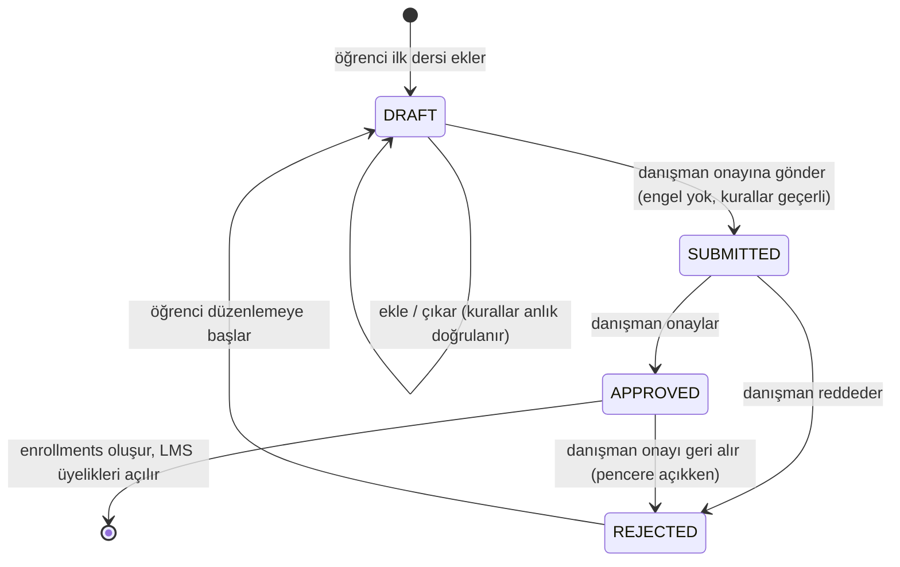
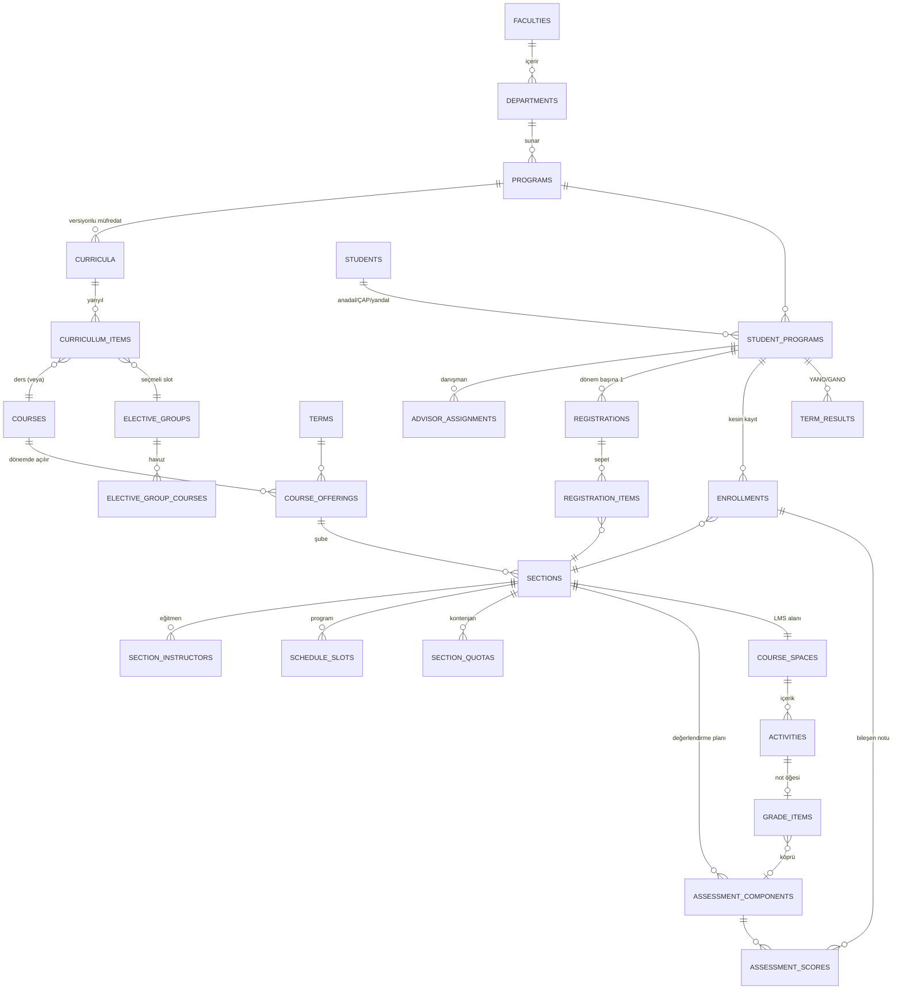

# 04 · Veri Modeli (OLTP)

> **Durum:** Taslak v0.1 · Veritabanı: **PostgreSQL 18** · İlgili: [03 · AuthN/AuthZ](03-kimlik-dogrulama-ve-yetkilendirme.md), [05 · OLAP](05-analitik-olap.md)
>
> Bu doküman **mantıksal** veri modelidir: tablolar, sütunlar, kısıtlar ve gerekçeler. Fiziksel DDL'i (migration dosyalarını) backend tarafında **sen** yazacaksın. Bu doküman o işin referansıdır.

## 0. Konvansiyonlar

| Konu | Karar | Gerekçe |
| --- | --- | --- |
| Şemalar | Her bounded context bir PostgreSQL şeması: `iam`, `org`, `people`, `academic`, `curriculum`, `offering`, `enrollment`, `grading`, `attendance`, `lms`, `communication`, `survey`, `documents`, `applications`, `finance`, `integration`, `platform`, `audit` + analitik için `dw` | Modül sınırları DB'de de görünür olur. Yetki (GRANT) şema bazında verilebilir |
| Birincil anahtar | `id uuid PRIMARY KEY DEFAULT uuidv7()` (PG 18 yerleşik) | Zaman sıralı → B-tree dostu. URL'de tahmin edilemez. Dağıtık üretime uygun |
| Yüksek hacimli log tabloları | `id bigint GENERATED ALWAYS AS IDENTITY` + zaman bazlı partition | Kompakt, partition anahtarıyla birleşik PK |
| Zaman | `timestamptz` (UTC saklanır), görüntülemede `Europe/Istanbul` | Saat dilimi hatalarını önler |
| Ortak sütunlar | `created_at`, `updated_at` (ve gerekiyorsa `created_by`, `updated_by`) | |
| İyimser kilit | Değişken agregalarda `version int NOT NULL DEFAULT 1` | Kayıp güncelleme (lost update) önleme, `If-Match` / ETag |
| Soft delete | Sadece gereken yerde (`deleted_at`): LMS içeriği, mesajlar | Akademik kayıtlar silinmez, durum değiştirir |
| Enum'lar | `text` + `CHECK (x IN (...))` (sabit kümeler) · **lookup tablosu** (yöneticinin genişletebildiği kümeler) | PG `ENUM` tipine değer çıkarmak zahmetli |
| Para | `numeric(12,2)` + `currency char(3)` | Kayan nokta asla |
| Not / puan | `numeric(5,2)` · AKTS/kredi `numeric(4,1)` · katsayı `numeric(3,2)` | |
| Çok dilli ad | `name_tr`, `name_en` sütunları | İki dil sabit. Çeviri tablosu gereksiz karmaşıklık |
| Büyük/küçük harf duyarsız | `citext` eklentisi (kullanıcı adı, e-posta) | |
| Eklentiler | `citext`, `btree_gist` (EXCLUDE kısıtları), `pg_trgm` (arama), `pgcrypto` (yardımcı) | |
| FK davranışı | Varsayılan `ON DELETE RESTRICT`. Sadece saf alt-detay tablolarında `CASCADE` | Yanlışlıkla toplu silmeyi önler |

**Okuma ipucu:** `PK` birincil anahtar, `FK→x` yabancı anahtar, `UQ` benzersiz, `NN` not null, `CK` check kısıtı.

---

## 1. `iam` — Kimlik ve Erişim

### `iam.users`
| Sütun | Tip | Kısıt / Not |
| --- | --- | --- |
| id | uuid | PK |
| person_id | uuid | FK→people.persons, UQ, NN |
| username | citext | UQ, NN (öğrenci/personel no) |
| email | citext | UQ, NN |
| status | text | CK: `PENDING, ACTIVE, SUSPENDED, DISABLED` |
| password_hash | text | argon2id PHC string |
| password_changed_at | timestamptz | |
| must_change_password | bool | default false |
| mfa_enabled | bool | default false |
| mfa_secret_enc | bytea | AES-GCM şifreli TOTP sırrı (kullanıcı kimliğine bağlı). Kurulum başlayınca dolar |
| mfa_last_used_step | bigint | TOTP tekrar kullanım koruması |
| mfa_enabled_at | timestamptz | `mfa_enabled` ise dolu (CHECK) |
| failed_login_count | int | default 0 |
| locked_until | timestamptz | artan bekleme süresi |
| last_login_at | timestamptz | |
| perm_version | int | default 1. Rol değişince artar, yetki önbelleğini geçersizler |
| created_at, updated_at | timestamptz | |

### `iam.sessions`
| Sütun | Tip | Not |
| --- | --- | --- |
| id | uuid | PK (= token ailesi / family) |
| user_id | uuid | FK→users, index |
| client_type | text | CK: `WEB, MOBILE` |
| ip | inet | |
| user_agent | text | |
| device_label | text | "Chrome · macOS" |
| amr | text[] | `{pwd, otp}` |
| created_at | timestamptz | |
| last_seen_at | timestamptz | boşta kalma kontrolü |
| absolute_expires_at | timestamptz | +90 gün |
| revoked_at | timestamptz | |
| revoke_reason | text | `LOGOUT, LOGOUT_ALL, REUSE_DETECTED, PASSWORD_RESET, ADMIN` |

### `iam.refresh_tokens`
| Sütun | Tip | Not |
| --- | --- | --- |
| id | uuid | PK |
| session_id | uuid | FK→sessions ON DELETE CASCADE |
| token_hash | bytea | UQ (SHA-256) |
| parent_id | uuid | FK→refresh_tokens (zincir) |
| issued_at, expires_at | timestamptz | |
| used_at | timestamptz | dolu ise tekrar kullanım = saldırı (tolerans penceresi hariç) |
| replaced_by_id | uuid | |

### Diğer `iam` tabloları
| Tablo | Sütunlar | Not |
| --- | --- | --- |
| `mfa_recovery_codes` | id, user_id, code_hash (HMAC-SHA256), created_at, used_at | MFA kurtarma, UQ(user_id, code_hash) |
| `mfa_challenges` | id, user_id, token_hash UQ, client_type, attempts, expires_at, consumed_at | Parolası doğru, ikinci adımı bekleyen giriş (5 dk, 5 deneme) |
| `password_reset_tokens` | id, user_id, token_hash UQ, expires_at, used_at, requested_ip | 30 dk, tek kullanımlık |
| `roles` | id, code UQ, name_tr, name_en, scope_type CK(`UNIVERSITY, FACULTY, DEPARTMENT, PROGRAM, NONE`), is_system, description | |
| `permissions` | id, code UQ (`score:enter`), resource, action, description, requires_mfa bool | |
| `role_permissions` | role_id, permission_id — PK(ikisi) | Matris DB'de veri |
| `role_assignments` | id, user_id, role_id, scope_type, scope_id (uuid null), valid_from, valid_until, assigned_by, reason, created_at | CK: scope_type = rolün scope_type'ı. `EXCLUDE USING gist (user_id WITH =, role_id WITH =, scope_id WITH =, tstzrange(valid_from, valid_until) WITH &&)` çakışan atamayı engeller |
| `consents` | id, user_id, document_code, document_version, accepted_at, ip | KVKK aydınlatma onayı |

---

## 2. `people` — Kişiler

| Tablo | Sütunlar | Not |
| --- | --- | --- |
| `persons` | id, national_id_enc bytea, national_id_hmac bytea **UQ**, passport_no_enc, first_name, last_name, birth_date, gender CK(`FEMALE, MALE, UNDISCLOSED`), nationality char(2), photo_file_id FK→platform.files, created_at, updated_at | TC No şifreli + HMAC kör indeks ile aranabilir |
| `person_contacts` | id, person_id, contact_type CK(`EMAIL_INSTITUTIONAL, EMAIL_PERSONAL, PHONE_MOBILE, PHONE_HOME`), value, is_primary, verified_at | |
| `person_addresses` | id, person_id, address_type CK(`HOME, CORRESPONDENCE`), country, city, district, line1, line2, postal_code | |
| `students` | id, person_id UQ, student_no UQ, created_at | Program bilgisi `enrollment.student_programs`'ta |
| `academic_titles` | code PK (`PROF, ASSOC_PROF, ASSIST_PROF, LECTURER_DR, LECTURER, RESEARCH_ASSISTANT, RESEARCH_ASSISTANT_DR`), name_tr ("Prof. Dr."), name_en, rank | lookup |
| `staff` | id, person_id UQ, staff_no UQ, staff_type CK(`ACADEMIC, ADMINISTRATIVE`), academic_title_code FK, primary_department_id FK→org.departments, office_location, office_phone, employment_status CK(`ACTIVE, ON_LEAVE, LEFT`), hired_on, left_on | |
| `staff_office_hours` | id, staff_id, term_id, day_of_week smallint CK(1–7), start_time, end_time, location, note | Danışman görüşme saatleri |
| `special_needs` | person_id PK, category, details_enc bytea, accommodations text | **Özel nitelikli veri**, ayrı yetki (P2) |

---

## 3. `org` — Organizasyon ve Mekân

| Tablo | Sütunlar | Not |
| --- | --- | --- |
| `campuses` | id, code UQ, name, address | |
| `faculties` | id, code UQ, name_tr, name_en, unit_type CK(`FACULTY, VOCATIONAL_SCHOOL, SCHOOL, INSTITUTE, CONSERVATORY`), campus_id, is_active | "Birim" |
| `departments` | id, faculty_id FK, code UQ, name_tr, name_en, is_active | |
| `programs` | id, department_id FK, code UQ, yoksis_code, name_tr, name_en, degree_level CK(`ASSOCIATE, BACHELOR, MASTER, PHD`), language CK(`TR, EN, MIXED`), education_type CK(`DAYTIME, EVENING, DISTANCE`), duration_semesters smallint, max_duration_years smallint, total_ects_required numeric(5,1), has_prep_class bool, is_active | "Bilgisayar Mühendisliği (İngilizce) (N.Ö.)" |
| `buildings` | id, campus_id, code, name | UQ(campus_id, code) |
| `classrooms` | id, building_id, code, name, capacity int, exam_capacity int, room_type CK(`LECTURE, LAB, AMPHI, OFFICE, ONLINE`), features text[], is_active | "Derslik 3", "Öğretim Üyesi Odası" |

---

## 4. `academic` — Akademik Takvim

| Tablo | Sütunlar | Not |
| --- | --- | --- |
| `academic_years` | id, start_year smallint UQ (2026 → "2026-2027"), starts_on, ends_on | |
| `terms` | id, academic_year_id FK, term_type CK(`FALL, SPRING, SUMMER`), code UQ (`2026-FALL`), starts_on, ends_on, status CK(`PLANNED, ACTIVE, CLOSED`), is_current bool, version | UQ(year, term_type). Kısmi UQ: `WHERE is_current` → tek aktif dönem. CK: kapanmış dönem aktif olamaz |
| `calendar_event_types` | code PK, name_tr, name_en, category CK(`REGISTRATION, INSTRUCTION, EXAM, GRADING, ADMISSION, OTHER`), is_action_window bool, sort_order | lookup (aşağıda), migration'la gelir |
| `calendar_events` | id, term_id FK, event_type_code FK, title_tr null, title_en null, **period tstzrange NN**, scope_type CK(`UNIVERSITY, FACULTY, PROGRAM`), scope_id uuid null, is_published, note, version | GiST index (period). `EXCLUDE USING gist (event_type_code WITH =, scope_type WITH =, coalesce(scope_id, '00000000-…') WITH =, period WITH &&)` → aynı kapsamda çakışan pencere yok. Oluşturan denetim izinde (created_by sütunu yok) |

**Olay türleri** (`calendar_event_types.code`): `COURSE_REGISTRATION`, `ADVISOR_APPROVAL`, `DEPT_HEAD_APPROVAL`, `ADD_DROP_STUDENT`, `ADD_DROP_ADVISOR`, `ADD_DROP_DEPT_HEAD`, `ADVISOR_MEETING`, `CLASSES`, `MIDTERM_EXAMS`, `MIDTERM_GRADE_ENTRY`, `FINAL_EXAMS`, `FINAL_GRADE_ENTRY`, `MANUAL_LETTER_GRADE`, `MAKEUP_EXAMS`, `MAKEUP_GRADE_ENTRY`, `THREE_COURSE_EXAMS`, `SURVEY_PERIOD`, `DOUBLE_MAJOR_APPLICATION`, `DOUBLE_MAJOR_PLACEMENT`, `DOUBLE_MAJOR_CONFIRMATION`, `PREP_REGISTRATION`, `PRE_REGISTRATION_OSYS`, `PRE_REGISTRATION_DGS`, `ORIENTATION`, `HOLIDAY`.

**Pencere çözümleme kuralı:** hedef (program → birim → üniversite) için bir türün olayları en dar kapsamdan başlanarak aranır: programın kendi olayı varsa o, yoksa birimin, o da yoksa üniversitenin olayları uygulanır (dar kapsam geniş kapsamı geçersiz kılar). Pencere, uygulanan olaylardan biri `period @> now()` ise açıktır. Taslak (yayımlanmamış) olaylar sayılmaz. `GET /calendar/windows` her işlem penceresi için açık mı, şimdiki ve sıradaki olayı ve uygulanan kapsamı döndürür.

---

## 5. `curriculum` — Katalog, Müfredat, Not Ölçeği

### Ders kataloğu
| Tablo | Sütunlar | Not |
| --- | --- | --- |
| `courses` | id, code UQ CK(`^[A-Z]{2,6}[0-9]{3,4}$`), owner_department_id FK null, name_tr, name_en, theory_hours smallint, practice_hours smallint, national_credit numeric(4,1), ects numeric(4,1), language CK(`TR, EN`), course_kind CK(`REGULAR, NON_CREDIT, INTERNSHIP, PROJECT, PREP, ACTIVITY`), grading_mode CK(`LETTER, PASS_FAIL`), description_tr, description_en, learning_outcomes jsonb (dizi), is_active, version | Sahibi boşsa üniversite ortak dersi (TUR, HIS, ENG ...). OUL101 → `NON_CREDIT` + `PASS_FAIL` (BŞR/BŞZ), staj → `INTERNSHIP`. **Kod değişmez**: saati, kredisi ya da AKTS'si değişen ders yeni kodla açılır, eskiyle eşdeğerlik kurulur. Kod/ad araması trigram index'iyle |
| `course_prerequisites` | id, course_id FK, prerequisite_course_id FK, requirement CK(`PASSED, ATTENDED`), group_no smallint | Aynı `group_no` = **VEYA**, farklı grup = **VE**. UQ(çift), CK(kendisi olamaz). Küme tek seferde değişir; döngü (doğrudan ya da dolaylı) özyinelemeli sorguyla engellenir, eşzamanlı değişiklikler advisory lock ile sıraya girer |
| `course_equivalences` | id, course_id (yeni kod), equivalent_course_id (eski kod), is_bidirectional, valid_from_year, note | Eski↔yeni kod (COM4519 ↔ COM4569). Aynı çift ters yönde de olsa bir kez. Onaylayan denetim izinde |

### Seçmeli gruplar
| Tablo | Sütunlar | Not |
| --- | --- | --- |
| `elective_groups` | id, code UQ (`COMTE02`, `UNVGOFECG`, `PFESECG3YY`), name_tr, name_en, owner_department_id null, group_kind CK(`TECHNICAL, UNIVERSITY_GENERAL, PEDAGOGICAL, SOCIAL, FREE`), is_active, version | Sahibi boşsa üniversite geneli havuz |
| `elective_group_courses` | elective_group_id, course_id — PK(ikisi) | Havuz. Üyelik idempotent `PUT` |

### Müfredat (versiyonlu)
| Tablo | Sütunlar | Not |
| --- | --- | --- |
| `curricula` | id, program_id FK, name_tr, name_en, effective_from_year smallint, effective_to_year smallint null, total_ects_required, status CK(`DRAFT, ACTIVE, ARCHIVED`), decision_ref, copied_from_id, activated_at, archived_at, version | Öğrenci giriş yılına göre müfredata bağlanır (2023+ alan dışı kuralı burada doğal çözülür). Yürürlükteki sürümlerin giriş yılları çakışamaz: `EXCLUDE USING gist (program_id WITH =, int4range(from, to, '[]') WITH &&) WHERE (status = 'ACTIVE')`. Yürürlüğe girerken satırların AKTS toplamı gerekenle tutmalı, yarıyıllar program süresini aşmamalı; aralıktaki bağlantısız öğrenci kayıtları bağlanır. Yürürlükteki sürümde satırlar, giriş yılı başlangıcı ve AKTS toplamı donar |
| `curriculum_items` | id, curriculum_id FK, semester_no smallint CK(1–12), item_type CK(`COURSE, ELECTIVE_SLOT`), course_id null, elective_group_id null, slot_theory_hours, slot_practice_hours, slot_national_credit, slot_ects, slot_course_count, is_compulsory bool, position | CK: `COURSE` ise course_id dolu ve yuva alanları boş; `ELECTIVE_SLOT` ise tersi ve zorunlu değil. UQ(curriculum_id, course_id) (NULL'lar ayrı: yuvalar tekrarlanabilir). Bir yuva birden fazla dersi kapsayabilir ("4. sınıf teknik seçmeli, 4 ders, 16 AKTS"); saat, kredi ve AKTS bu derslerin toplamıdır |

`enrollment.student_programs.curriculum_id` öğrencinin izlediği sürümdür.

### Not ölçeği
| Tablo | Sütunlar | Not |
| --- | --- | --- |
| `grade_scales` | id, code UQ, name_tr, name_en, effective_from_year, is_default, version | Yönetmelik değişikliği → yeni ölçek. Kısmi UQ: tek varsayılan ölçek; varsayılan doğrudan kaldırılamaz, başka ölçek varsayılan yapılır |
| `grade_scale_items` | id, grade_scale_id FK, letter, coefficient numeric(3,2) null, min_score numeric(5,2) null, max_score numeric(5,2) null, is_passing, counts_in_gpa, earns_ects, is_attendance_fail, sort_order | UQ(scale, letter). Puan aralıkları çakışamaz (`EXCLUDE ... numrange WITH &&`) ve 0-100'ü tam sayılarla boşluksuz kapsamalı (doğrulama). Satırlar: A … C3, F2 (puanla), F1 (`is_attendance_fail`), BŞR/BŞZ (`counts_in_gpa = false`), `MUAF` (muafiyet). Ankara Üniversitesi lisans ölçeği migration'la gelir |
| `regulation_parameters` | key, value jsonb, effective_from date, effective_to date null (hariç), description_tr, note — PK(key, effective_from) | **Kural parametreleri veri olarak**: `ects_limit_by_gpa` = `[{"max_gpa":1.99,"ects":30},{"max_gpa":2.99,"ects":40},{"max_gpa":4,"ects":45}]`, `semester_ects_load`, `final_min_score` = 50, `pass_min_score` = 50, `attendance_max_absence_pct` = `{"THEORY":30,"PRACTICE":20}`, `max_courses_after_max_duration` = 5, `honor_gpa`. Aynı anahtarın dönemleri çakışamaz (`EXCLUDE ... daterange`); yeni değer eskisini o gün kapatır, JSON türü korunur. Yeni anahtar API'den değil, onu okuyan kodla birlikte migration'la eklenir |

---

## 6. `offering` — Ders Açma, Şube, Program

| Tablo | Sütunlar | Not |
| --- | --- | --- |
| `course_offerings` | id, term_id FK, course_id FK, department_id FK (açan bölüm, yetki kapsamı), external_ref (`760535`), status CK(`PLANNED, OPEN, CLOSED, CANCELLED`), note, version | UQ(term_id, course_id): ders dönemde bir kez açılır, öğrenci grupları şubelerle. Geçişler: PLANNED → OPEN → CLOSED, OPEN → PLANNED, PLANNED/OPEN → CANCELLED (kayıtlı öğrenci varken iptal ve planlamaya dönüş olmaz; iptal şubeleri iptal eder, derslikleri boşaltır) |
| `sections` | id, offering_id FK, section_code (`1`, `2`, `A`), capacity int, enrolled_count int default 0, quota_mode CK(`OPEN, RESERVED`), instruction_mode CK(`IN_PERSON, ONLINE, HYBRID`), language, status CK(`ACTIVE, CANCELLED`), version, assessment_plan_version, assessment_plan_locked_at, assessment_plan_locked_by | UQ(offering_id, section_code). **CK(enrolled_count BETWEEN 0 AND capacity)**. Kontenjan program kontenjanları toplamının altına inemez; teorik oturumların derslikleri kontenjanı almalı. Not kesinleşme ve yayımlama sütunları Faz 5'te |
| `section_quotas` | id, section_id FK, program_id FK, quota int, enrolled int default 0 | `RESERVED` modda program bazlı kontenjan. CK(enrolled ≤ quota). UQ(section_id, program_id). Toplam ≤ şube kontenjanı; öğrencisi olan programın kontenjanı kaldırılamaz |
| `section_instructors` | section_id, staff_id, role CK(`PRIMARY, CO_INSTRUCTOR, ASSISTANT`) — PK(section_id, staff_id) | Kısmi UQ: tek sorumlu (`WHERE role = 'PRIMARY'`). Sadece görevdeki akademik personel. **İlişki tabanlı yetkinin kaynağı** (değerlendirme planı, not girişi, yoklama) |
| `schedule_slots` | id, section_id FK, term_id (denormalize), day_of_week smallint (ISO 1–7), **time_span offering.timerange**, classroom_id null, session_type CK(`THEORY, PRACTICE, LAB`) | `CREATE TYPE offering.timerange AS RANGE (subtype = time)`; `[başlangıç, bitiş)`, 07:00–23:00. **Derslik çakışması**: `EXCLUDE USING gist (term_id WITH =, classroom_id WITH =, day_of_week WITH =, time_span WITH &&) WHERE (classroom_id IS NOT NULL)`. **Şube içi çakışma**: `EXCLUDE (section_id WITH =, day_of_week WITH =, time_span WITH &&)` |

> **Eğitmen çakışması** (aynı eğitmen aynı saatte iki şubede) birden fazla tabloyu kapsadığı için EXCLUDE ile ifade edilemez. Servis katmanında kontrol edilir; dönem başına bir advisory lock (`pg_advisory_xact_lock`) program değişikliklerini sıraya sokar, böylece eşzamanlı iki atama ayrı ayrı denetimden geçip birlikte çakışma oluşturamaz. Bu, "kural nerede yaşamalı: DB mi uygulama mı?" tartışması için güzel bir örnek. Çakışma hataları çakışan dersi ve saati söyler ("Derslik bu saatte dolu: COM3035-1 (Salı 09:00-11:50)"). Teorik oturumun dersliği şube kontenjanını almalı (uygulama ve laboratuvar oturumları grup grup yapılabildiği için onlarda aranmaz).

---

## 7. `enrollment` — Program Kaydı ve Ders Seçme

### Program kaydı
| Tablo | Sütunlar | Not |
| --- | --- | --- |
| `student_programs` | id, student_id FK, program_id FK, curriculum_id FK, enrollment_kind CK(`MAJOR, DOUBLE_MAJOR, MINOR`), admission_type CK(`OSYS, DGS, YOS, TRANSFER_INTERNAL, TRANSFER_EXTERNAL, SPECIAL_TALENT, EXCHANGE`), admission_year smallint, admission_term_id, admitted_on, status CK(`PREP, ACTIVE, FROZEN, SUSPENDED, GRADUATED, WITHDRAWN, DISMISSED`), status_changed_at, class_level smallint, current_semester smallint, max_duration_term_id FK, continuation_right bool, graduated_on, gpa_cache numeric(3,2), earned_ects_cache numeric(5,1), version | UQ(student_id, program_id). "Aktif Bölüm" seçici bu tablodaki satırlar arasında geçiş yapar |
| `student_program_status_history` | id, student_program_id, from_status, to_status, reason, decision_ref, changed_by, changed_at | Kayıt dondurma, uzaklaştırma, mezuniyet geçmişi |
| `advisor_assignments` | id, student_program_id FK, advisor_staff_id FK, valid_from, valid_until null, assigned_by | Kısmi UQ(student_program_id) `WHERE valid_until IS NULL` → tek aktif danışman |
| `holds` | id, student_program_id FK, hold_type CK(`TUITION_DEBT, DISCIPLINE_SUSPENSION, MISSING_DOCUMENT, LIBRARY_DEBT`), blocks text[] (`REGISTRATION, DOCUMENT, GRADUATION`), reason, placed_by, placed_at, released_by, released_at | Aktif engel = `released_at IS NULL` |

### Ders seçme (registration)
| Tablo | Sütunlar | Not |
| --- | --- | --- |
| `registrations` | id, student_program_id FK, term_id FK, status CK(`DRAFT, SUBMITTED, APPROVED, REJECTED`), total_ects numeric(4,1), max_ects_allowed numeric(4,1), gpa_snapshot numeric(3,2), submitted_at, decided_at, decided_by, decision_note, version | UQ(student_program_id, term_id) |
| `registration_items` | id, registration_id FK, section_id FK, course_id (denormalize), item_kind CK(`NEW, REPEAT_FAILED, REPEAT_UPGRADE, ELECTIVE_REPLACEMENT`), curriculum_item_id null, elective_group_id null, source CK(`REGISTRATION, ADD_DROP`), status CK(`ACTIVE, DROPPED`), added_at, dropped_at | Kısmi UQ(registration_id, course_id) `WHERE status='ACTIVE'` → aynı dersin iki şubesi seçilemez |
| `registration_events` | id bigint identity, registration_id, event_type (`CREATED, ITEM_ADDED, ITEM_REMOVED, SUBMITTED, APPROVED, REJECTED, ADD_DROP_REQUESTED …`), actor_user_id, payload jsonb, occurred_at | Durum geçmişi + **kayıt hunisi** analitiğinin kaynağı |
| `add_drop_requests` | id, registration_id, status CK(`PENDING_ADVISOR, PENDING_DEPT_HEAD, APPROVED, REJECTED`), advisor_decided_by/at, head_decided_by/at, note | P1 |
| `add_drop_items` | id, request_id, section_id, action CK(`ADD, DROP`) | |

**Durum makinesi:**



### Kesinleşmiş ders kayıtları ve sonuçlar
| Tablo | Sütunlar | Not |
| --- | --- | --- |
| `enrollments` | id, student_program_id FK, section_id FK, term_id, course_id (denormalize), registration_item_id, attempt_no smallint, is_repeat, attendance_status CK(`CONTINUING, ATTENDANCE_FAIL`), weighted_score numeric(5,2), letter_grade text, grade_points numeric(3,2), ects_snapshot numeric(4,1), credit_snapshot numeric(4,1), counts_in_gpa bool, superseded_by_id FK→enrollments, status CK(`ENROLLED, DROPPED, COMPLETED`), grade_published_at, created_at, version | UQ(student_program_id, section_id). Index(student_program_id, course_id). **Tekrar alınan derste** eski kaydın `counts_in_gpa=false`, `superseded_by_id`=yeni kayıt ("son not geçerli") |
| `transfer_credits` | id, student_program_id, course_id (yerel karşılık), source_type CK(`TRANSFER, EXEMPTION, MOOC`), source_institution, source_course_name, letter_grade, ects, credited_term_id, decision_ref, decided_by, decided_at | Muafiyet/intibak, edX/Coursera |
| `term_results` | id, student_program_id, term_id, attempted_ects, earned_ects, term_gpa (YANO), cumulative_ects, cumulative_gpa (GANO), standing CK(`NORMAL, HONOR, HIGH_HONOR`), computed_at | UQ(student_program_id, term_id). Not ilanında olayla yeniden hesaplanır |
| `risk_scores` | student_program_id, term_id, score smallint CK(0–100), level CK(`LOW, MEDIUM, HIGH`), signals jsonb, computed_at — PK(student_program_id, term_id) | DW'deki gece işi hesaplar ve buraya geri yazar. Sadece danışman ve fakülte kapsamı okur ([05 · OLAP §8](05-analitik-olap.md)) |

---

## 8. `grading` — Değerlendirme

| Tablo | Sütunlar | Not |
| --- | --- | --- |
| `assessment_types` | code PK (`MIDTERM, QUIZ, HOMEWORK, PROJECT, LAB, PRESENTATION, PARTICIPATION, FINAL, MAKEUP`), name_tr, name_en, category CK(`IN_TERM, FINAL, MAKEUP`), sort_order | lookup, migration'la gelir |
| `assessment_components` | id, section_id FK, type_code FK, sequence_no (Ara sınav 1, 2), name_tr null, name_en null, weight numeric(5,2), scheduled_on date, position | UQ(section, type, sequence_no); kısmi UQ'larla tek final ve tek bütünleme. Yazarken doğrulama: Σ(IN_TERM + FINAL) = 100, tek final; bütünleme istemciden gelmez, finalin ağırlığıyla türetilir. Yeniden yazmada aynı tür+sıra numaralı bileşenin kimliği korunur (notlar bileşene bağlanacak). Planı şubenin sorumlu/ortak öğretim elemanı (ilişki) ya da bölüm düzenler; öğretim elemanı kilitler (`sections.assessment_plan_locked_at`), kilidi gerekçeyle bölüm açar. `max_score`, `published_at` Faz 5'te |
| `assessment_scores` | id, component_id FK, enrollment_id FK, score numeric(5,2) null, status CK(`NOT_ENTERED, SCORED, ABSENT, EXCUSED`), source CK(`MANUAL, LMS, IMPORT`), entered_by, entered_at, version | UQ(component_id, enrollment_id) |
| `grade_change_requests` | id, enrollment_id, component_id null, old_value jsonb, new_value jsonb, reason, requested_by, requested_at, status CK(`PENDING, APPROVED, REJECTED, APPLIED`), reviewed_by, reviewed_at, review_note | Görevler ayrılığı: reviewed_by ≠ requested_by (CK) |
| `section_grade_stats` | section_id PK, student_count, mean, median, stddev, letter_distribution jsonb, computed_at | "Sınıfın Ortalaması" için önbellek |
| `exams` | id, component_id FK, starts_at, ends_at, mode CK(`IN_PERSON, ONLINE`), lms_quiz_activity_id null | P1 sınav takvimi |
| `exam_rooms` / `exam_proctors` | exam_id + classroom_id / staff_id | P1 |

**Harf notu hesaplama** (servis kuralı, kod + test):
1. Bileşen yoksa (`NOT_ENTERED`) → hesaplanmaz.
2. `attendance_status = ATTENDANCE_FAIL` → **F1**.
3. Bütünleme notu varsa final yerine geçer.
4. Ağırlıklı ortalama → ölçekteki aralık. Ek kural: final/bütünleme puanı `final_min_score` altındaysa → **F2** (parametre, yönetmelikten doğrulanacak).
5. `MANUAL_LETTER_GRADE` penceresinde eğitmen harf notunu elle de belirleyebilir (denetim izine gerekçe yazılır).

---

## 9. `attendance` — Yoklama

| Tablo | Sütunlar | Not |
| --- | --- | --- |
| `class_sessions` | id, section_id FK, schedule_slot_id null, starts_at, ends_at, session_type, classroom_id, status CK(`SCHEDULED, HELD, CANCELLED, MAKEUP`), topic | UQ(section_id, starts_at). Dönem başında programdan **otomatik üretilir** (tatiller hariç: `HOLIDAY` olayları) |
| `attendance_records` | id bigint identity, class_session_id, enrollment_id, status CK(`PRESENT, ABSENT, LATE, EXCUSED`), method CK(`MANUAL, QR, LIVE_SESSION`), recorded_by, recorded_at | **Partition**: `recorded_at` aylık. Hacim: ~92k öğrenci × ~7 ders × ~42 oturum ≈ 25M satır/dönem |

---

## 10. `lms` — Öğrenme Yönetimi (e-Kampüs'ün karşılığı)

### Ders alanı ve yapı
| Tablo | Sütunlar | Not |
| --- | --- | --- |
| `course_spaces` | id, section_id FK UQ, title, summary_html, merged_into_space_id null, created_at | **Şube başına 1 alan** (e-Kampüs'teki `[760535](COM4573) … [B]` ile aynı mantık). Birleştirilmiş şubeler için opsiyonel birleştirme |
| `space_members` | space_id, user_id, member_role CK(`STUDENT, INSTRUCTOR, ASSISTANT, OBSERVER`), source CK(`REGISTRATION, INSTRUCTOR_ASSIGNMENT, MANUAL`), joined_at, left_at — PK(space_id, user_id) | Kayıt onayı olayıyla **anında** doldurulur |
| `topics` | id, space_id FK, parent_topic_id null (alt bölüm), title, summary_html, position, is_visible, available_from, available_until | "Bölüm" / "Hafta" |
| `activities` | id, space_id FK, topic_id FK, activity_type CK(`RESOURCE, FOLDER, URL, PAGE, ASSIGNMENT, QUIZ, FORUM, LIVE_SESSION, LABEL`), title, description_html, position, is_visible, available_from, available_until, completion_rule CK(`NONE, VIEW, SUBMIT, PASS_GRADE, MANUAL`), created_by, created_at, updated_at, deleted_at | **Class-table inheritance**: ortak alanlar burada, türe özgü alanlar alt tablolarda (activity_id PK + FK) |

### Türe özgü tablolar
| Tablo | Sütunlar |
| --- | --- |
| `resources` | activity_id PK, file_id FK→platform.files |
| `folder_files` | activity_id, file_id, path, position |
| `urls` | activity_id PK, url, open_in_new_tab |
| `pages` | activity_id PK, body_html |
| `assignments` | activity_id PK, opens_at, due_at, cutoff_at, max_attempts smallint, submission_types text[] (`FILE, ONLINE_TEXT`), max_files, max_file_size_bytes, allowed_mime_types text[], max_score, late_policy CK(`ALLOW, DENY, PENALTY`), late_penalty_pct_per_day |
| `quizzes` | activity_id PK, opens_at, closes_at, time_limit_seconds, max_attempts, grading_method CK(`HIGHEST, LAST, FIRST, AVERAGE`), shuffle_questions, shuffle_options, results_visibility CK(`IMMEDIATE, AFTER_CLOSE, NEVER`), max_score |
| `forums` | activity_id PK, forum_kind CK(`ANNOUNCEMENTS, GENERAL, QNA`), students_can_start_threads, subscription_mode CK(`OPTIONAL, FORCED, DISABLED`) |
| `live_sessions` | activity_id PK, provider CK(`GOOGLE_MEET, ZOOM, BBB, TEAMS, OTHER`), join_url, starts_at, ends_at, recurrence_rule (RRULE), recording_url |

### Ödev teslimi
| Tablo | Sütunlar | Not |
| --- | --- | --- |
| `assignment_submissions` | id, assignment_id, user_id, attempt_no, status CK(`DRAFT, SUBMITTED, REOPENED`), online_text, submitted_at, is_late | UQ(assignment_id, user_id, attempt_no) |
| `submission_files` | submission_id, file_id | |
| `submission_feedback` | id, submission_id, score, feedback_html, feedback_file_id, graded_by, graded_at, released_at | Puan aynı zamanda `grade_item_scores`'a yazılır |
| `submission_comments` | id, submission_id, author_id, body, created_at | "Gönderim yorumları" |

### Sınav (quiz) ve soru bankası
| Tablo | Sütunlar | Not |
| --- | --- | --- |
| `question_banks` | id, owner_staff_id, space_id null, name | |
| `questions` | id, bank_id, question_type CK(`MCQ_SINGLE, MCQ_MULTI, TRUE_FALSE, SHORT_ANSWER, NUMERIC, ESSAY, MATCHING`), stem_html, default_points, body jsonb, tags text[], version, created_by | Türe göre değişen içerik (`options`, `correct`, `tolerance`, `pairs`) **JSONB**'de. Şema doğrulaması uygulamada. Bilinçli bir JSONB kullanım örneği |
| `quiz_slots` | id, quiz_id, position, question_id null, random_from_bank_id null, random_tag null, points | Sabit soru ya da bankadan rastgele |
| `quiz_attempts` | id, quiz_id, user_id, attempt_no, started_at, deadline_at, submitted_at, status CK(`IN_PROGRESS, SUBMITTED, AUTO_SUBMITTED, GRADED`), score, layout jsonb (soru/şık sırası snapshot) | UQ(quiz_id, user_id, attempt_no) |
| `quiz_answers` | id, attempt_id, question_id, question_version, response jsonb, is_correct, points_awarded, graded_by, feedback, answered_at | UQ(attempt_id, question_id) |

### Forum
| Tablo | Sütunlar |
| --- | --- |
| `forum_threads` | id, forum_activity_id, author_id, title, is_pinned, is_locked, post_count, last_post_at, created_at |
| `forum_posts` | id, thread_id, parent_post_id null, author_id, body_html, created_at, edited_at, deleted_at |
| `forum_subscriptions` | forum_activity_id, user_id — PK |

### Not defteri ↔ değerlendirme köprüsü (kritik entegrasyon)
| Tablo | Sütunlar | Not |
| --- | --- | --- |
| `grade_items` | id, space_id, activity_id null, name, max_score, **assessment_component_id FK→grading.assessment_components null**, weight_in_component numeric(5,2), is_hidden, released_at | Bir bileşen birden çok öğeden beslenebilir (ör. 3 ödev → ÖDEV %20) |
| `grade_item_scores` | grade_item_id, user_id, score, is_overridden, updated_at — PK | Bağlı öğenin puanı değişince → `assessment_scores (source='LMS')` yeniden hesaplanır |

```text
Ödev puanlandı ─▶ grade_item_scores ─▶ (bileşene bağlıysa) ağırlıklı topla ─▶ grading.assessment_scores [source=LMS]
                                                                              └─▶ eğitmen not ekranında "LMS'ten" rozetiyle görünür
```

### Tamamlama ve etkileşim
| Tablo | Sütunlar | Not |
| --- | --- | --- |
| `activity_completions` | activity_id, user_id, state CK(`INCOMPLETE, COMPLETE, COMPLETE_PASS, COMPLETE_FAIL`), completed_at — PK | İlerleme % |
| `events` | id bigint identity, occurred_at, user_id, space_id, activity_id, event_type (`VIEWED, DOWNLOADED, SUBMITTED, POSTED, QUIZ_STARTED, QUIZ_SUBMITTED, LIVE_JOINED`), meta jsonb | **Aylık partition**. OLAP `fact_lms_activity` kaynağı. 90 gün sonra eski partition'lar ambara aktarılıp düşürülür |

---

## 11. `communication` — Duyuru, Mesaj, Bildirim

| Tablo | Sütunlar | Not |
| --- | --- | --- |
| `announcements` | id, title, summary, body_html, announcement_type CK(`GENERAL, ACADEMIC, EXAM, URGENT, EVENT`), publish_from, publish_until, is_pinned, status CK(`DRAFT, PUBLISHED, ARCHIVED`), author_id, created_at, updated_at | OBS duyuru modeli (özet + içerik + başlangıç/bitiş + tür) |
| `announcement_audiences` | id, announcement_id, scope_type CK(`UNIVERSITY, FACULTY, DEPARTMENT, PROGRAM, SECTION`), scope_id null, role_code null | Çoklu hedef. Ör. "Mühendislik Fakültesi öğrencileri" |
| `announcement_reads` | announcement_id, user_id, read_at — PK | |
| `conversations` | id, conversation_type CK(`DIRECT, GROUP, SECTION`), section_id null, title, created_by, created_at, last_message_at | |
| `conversation_members` | conversation_id, user_id, member_role, joined_at, left_at, last_read_message_id, is_starred, muted_until — PK | "Yıldızlı / Grup / Özel" |
| `messages` | id (uuidv7 → zaman sıralı cursor), conversation_id, sender_id, body, reply_to_id null, created_at, edited_at, deleted_at | Index(conversation_id, id DESC) |
| `message_attachments` | message_id, file_id | |
| `notification_types` | code PK, category, name_tr, name_en, default_channels text[], is_mandatory | Güvenlik bildirimleri kapatılamaz |
| `notifications` | id bigint identity, created_at, user_id, type_code, title, body, link_path, payload jsonb, read_at, archived_at | **Aylık partition**. Kısmi index(user_id, created_at DESC) `WHERE read_at IS NULL` |
| `notification_preferences` | user_id, type_code, channel CK(`IN_APP, EMAIL, PUSH`), enabled — PK | e-Kampüs'teki tercih matrisinin karşılığı |
| `push_devices` | id, user_id, platform CK(`IOS, ANDROID`), expo_push_token UQ, device_name, last_seen_at, revoked_at | Mobil fazı |
| `email_outbox` | id, to_address, template_code, locale, payload jsonb, status CK(`PENDING, SENDING, SENT, FAILED`), attempts, next_attempt_at, last_error, created_at, sent_at | Worker işler, üstel geri çekilme |

---

## 12. `survey` — Anket (anonimlik tasarımı)

| Tablo | Sütunlar | Not |
| --- | --- | --- |
| `surveys` | id, survey_kind CK(`COURSE_EVALUATION, GENERAL`), term_id, title, opens_at, closes_at, is_anonymous, blocks_grade_view, min_responses_for_results smallint default 5, status | |
| `survey_questions` | id, survey_id, position, question_type CK(`LIKERT_5, SINGLE_CHOICE, MULTI_CHOICE, TEXT`), text_tr, text_en, options jsonb, is_required | |
| `survey_assignments` | id, survey_id, section_id null, user_id, completed_at | **Kimlik ↔ tamamlandı bilgisi burada**. UQ(survey_id, section_id, user_id) |
| `survey_responses` | id, survey_id, section_id, submitted_on **date** | **user_id YOK**. Zaman damgası güne yuvarlanır (zamanlama korelasyonunu zorlaştırır) |
| `survey_answers` | response_id, question_id, value_int, value_text, value_options text[] | |

> Anonimlik iddiası "biz bakmayız" değil, **şema ile garanti**: yanıt satırından kişiye giden bir yol yok. Sonuçlar `min_responses_for_results` altındaysa gösterilmez (k-anonimlik).

---

## 13. `documents` — Belge Talepleri

| Tablo | Sütunlar | Not |
| --- | --- | --- |
| `document_types` | code PK (`STUDENT_CERTIFICATE, TRANSCRIPT`), name_tr, name_en, template_code | |
| `document_reasons` | code PK (`OFFICIAL, PRIVATE, FOREIGN_COUNTRY_EN, OFFICIAL_WITH_DISCIPLINE, OFFICIAL_WITH_EXPECTED_GRADUATION, OFFICIAL_TRANSFER_NO_OBSTACLE`), name_tr, name_en, content_flags jsonb | OBS'deki seçeneklerin birebir karşılığı |
| `document_requests` | id, student_program_id, document_type_code, reason_code, language CK(`TR, EN`), status CK(`REQUESTED, GENERATING, PENDING_SIGNATURE, READY, REJECTED, EXPIRED`), requested_at, ready_at, file_id, **verification_code UQ** (insan dostu, 12 karakter base32), content_sha256 bytea, signature bytea, signing_key_id, expires_at, rejected_reason, processed_by | Engel varsa (`blocks @> {DOCUMENT}`) reddedilir |
| `document_verifications` | id bigint identity, verification_code, verified_at, ip_hash, result | Halka açık doğrulama log'u |

---

## 14. `applications`, `finance`, `integration` (P1–P2)

| Şema.Tablo | Sütunlar | Not |
| --- | --- | --- |
| `applications.application_types` | code PK (`DOUBLE_MAJOR, MINOR, REGISTRATION_FREEZE, COURSE_EXEMPTION, GRADE_OBJECTION, GENERIC_PETITION`), workflow jsonb (adımlar + rol) | Basit, veriyle tanımlı iş akışı |
| `applications.applications` | id, applicant_user_id, student_program_id, type_code, term_id, status, current_step, payload jsonb, submitted_at, decided_at | |
| `applications.application_decisions` | id, application_id, step_no, role_code, decided_by, decision CK(`APPROVE, REJECT, RETURN`), note, decided_at | |
| `applications.double_major_placements` | id, application_id, target_program_id, rank, score, is_placed, student_confirmed_at | "ÇAP/Yandal Yerleştirme Onay" |
| `finance.tuition_fees` | id, student_program_id, term_id, fee_type CK(`CONTRIBUTION, TUITION, SUMMER_SCHOOL`), reason CK(`OVER_DURATION, SECOND_UNIVERSITY, EVENING, INTERNATIONAL`), amount numeric(12,2), currency, due_date, status CK(`UNPAID, PARTIAL, PAID, WAIVED, CANCELLED`) | Vadesi geçmiş borç → worker `TUITION_DEBT` engeli koyar |
| `finance.payments` | id, tuition_fee_id, amount, paid_at, channel, external_ref, recorded_by | Simülasyon |
| `integration.yoksis_sync_requests` | id, student_program_id, requested_by, requested_at, **request_date date** (İstanbul saatine göre), status CK(`QUEUED, SENT, SUCCEEDED, FAILED`), response_code, response_message, attempts, finished_at | UQ(student_program_id, request_date) → **günde 1 kuralı DB'de** |
| `integration.campus_card_requests` | id, person_id, photo_file_id, status, requested_at, updated_at | Simülasyon |
| `integration.library_accounts` | person_id PK, member_no, status, synced_at | Simülasyon |

---

## 15. `platform` ve `audit`

| Şema.Tablo | Sütunlar | Not |
| --- | --- | --- |
| `platform.files` | id, bucket, storage_key UQ, original_name, mime_type, size_bytes bigint, sha256 bytea, uploaded_by, uploaded_at, scan_status CK(`PENDING, CLEAN, INFECTED, SKIPPED`), deleted_at | MinIO (S3). İndirme imzalı URL ile. Erişim kontrolü sahibi olan varlık üzerinden |
| `platform.outbox_events` | id bigint identity, aggregate_type, aggregate_id, event_type, payload jsonb, occurred_at, available_at, published_at, attempts, last_error | **Transactional outbox**: iş verisiyle aynı transaction'da yazılır. Worker okur ve yayınlar. Kısmi index `WHERE published_at IS NULL` |
| `platform.idempotency_keys` | key, user_id, request_hash, response_status, response_body jsonb, created_at, expires_at — PK(user_id, key) | "Danışmana gönder" gibi POST'larda çift tıklama ve yeniden deneme güvenliği |
| `platform.user_preferences` | user_id PK, locale, theme CK(`LIGHT, DARK, SYSTEM`), dashboard_layout jsonb, messaging_privacy, updated_at | OBS "Ekran Ayarları" |
| `platform.user_favorites` | id, user_id, route_path, label, position | OBS "Sık Kullanılanlar" |
| `platform.helpdesk_tickets` | id, requester_id, category, subject, status CK(`OPEN, IN_PROGRESS, WAITING_USER, RESOLVED, CLOSED`), priority, assigned_to, created_at, resolved_at | P2 |
| `platform.helpdesk_messages` | id, ticket_id, author_id, body, is_internal, created_at | |
| `audit.audit_log` | id bigint identity, occurred_at, actor_user_id, impersonator_user_id, action, entity_type, entity_id, before jsonb, after jsonb, ip, user_agent, request_id — PK(id, occurred_at) | **Aylık partition**. Uygulama rolüne sadece INSERT |
| `audit.security_events` | id bigint identity, occurred_at, event_type, user_id null, username_attempted, ip, user_agent, details jsonb | Aylık partition |

---

## 16. Çekirdek ER Diyagramı (akademik omurga)



---

## 17. Eşzamanlılık ve Bütünlük Stratejileri

| Problem | Çözüm | Öğrenme konusu |
| --- | --- | --- |
| **Kontenjan aşımı** (10 bin öğrenci aynı anda) | `UPDATE offering.sections SET enrolled_count = enrolled_count + 1 WHERE id = $1 AND enrolled_count < capacity RETURNING enrolled_count`. 0 satır dönerse kontenjan dolu. Aynı transaction'da `registration_items` INSERT. Rezerve modda `section_quotas` için aynısı. CHECK kısıtı son savunma hattı | Atomik koşullu güncelleme, satır kilidi, `READ COMMITTED` davranışı |
| **AKTS limiti yarışı** (aynı öğrenci iki sekmeden iki ders ekler) | Öğrenci kaydı başına `pg_advisory_xact_lock(hashtextextended(student_program_id::text, 0))` ile serileştirme, sonra kural doğrulama | Advisory lock'lar |
| **Kayıp güncelleme** (iki sekme, iki düzenleme) | `version` sütunu + `UPDATE … WHERE id=$1 AND version=$2`. HTTP'de `ETag`/`If-Match` → 412 | İyimser kilitleme |
| **Çift gönderim** | `Idempotency-Key` başlığı + `platform.idempotency_keys` | İdempotentlik |
| **Kontenjan ne zaman düşer?** | **Öneri:** sepete eklerken rezerve edilir (OBS davranışı: "kontenjan doldu" sepete eklerken çıkıyor). Sepetten çıkarınca serbest kalır. Pencere kapanınca gönderilmemiş taslaklar worker tarafından serbest bırakılır (parametre) | İş kuralı kararı |
| **Derslik çakışması** | `EXCLUDE USING gist` + özel `timerange` | Range tipleri, GiST |
| **Takvim penceresi çakışması** | `EXCLUDE USING gist (… period WITH &&)` | |
| **Tek aktif danışman / tek aktif dönem** | Kısmi benzersiz index'ler | Partial index |
| **Olay yayını tutarlılığı** (kayıt onaylandı → LMS üyeliği + bildirim + ambar) | Transactional outbox → worker. Tüketiciler idempotent | Dual-write problemi |
| **GANO tutarlılığı** | Not ilanı olayı → `term_results` yeniden hesaplama + `student_programs.gpa_cache`. Gecelik doğrulama işi (tam yeniden hesap, fark varsa alarm) | Türetilmiş veri yönetimi |

## 18. Hacim Tahmini (1 akademik yıl, ~92 bin öğrenci)

| Tablo | Yaklaşık satır/yıl | Strateji |
| --- | --- | --- |
| `enrollments` | ~1,3 M | Normal tablo, index'ler |
| `assessment_scores` | ~5 M | Normal tablo |
| `attendance_records` | ~50 M | Aylık partition |
| `lms.events` | ~150 M+ | Aylık partition, 90 gün sıcak veri, sonra ambara özet + düşür |
| `notifications` | ~15 M | Aylık partition, 180 gün saklama |
| `audit_log` | ~30 M | Aylık partition, sınıfa göre saklama |
| `messages` | ~5 M | Normal tablo |

## 19. Önemli Index'ler (başlangıç listesi)

- `enrollment.registrations (student_program_id, term_id)` UQ
- `enrollment.registration_items (registration_id) WHERE status='ACTIVE'`
- `enrollment.enrollments (section_id)`, `(student_program_id, course_id)`, `(term_id)`
- `grading.assessment_scores (enrollment_id)`
- `offering.sections (offering_id)`, `offering.course_offerings (term_id)`
- `academic.calendar_events USING gist (period)`
- `lms.activities (space_id, topic_id, position)`
- `lms.assignments (due_at)` (zaman çizelgesi)
- `communication.notifications (user_id, created_at DESC) WHERE read_at IS NULL`
- `curriculum.courses USING gin ((code || ' ' || name_tr || ' ' || name_en) gin_trgm_ops)` (ders kodu ve adıyla arama)
- `iam.role_assignments (user_id) WHERE valid_until IS NULL OR valid_until > now()` → dikkat: `now()` index'te kullanılamaz. Bunun yerine `(user_id, valid_until)`

> Her index `EXPLAIN (ANALYZE, BUFFERS)` ile gerçek seed verisi üzerinde doğrulanacak. Yük testinde yavaş sorgular `pg_stat_statements` ile izlenecek.
