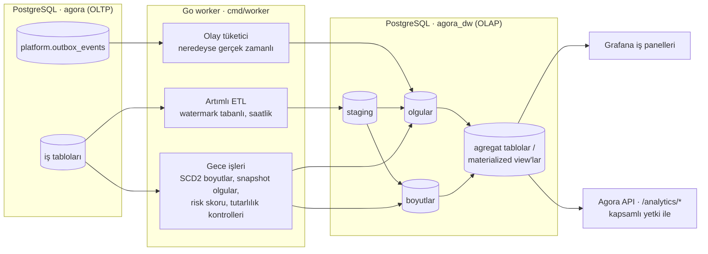
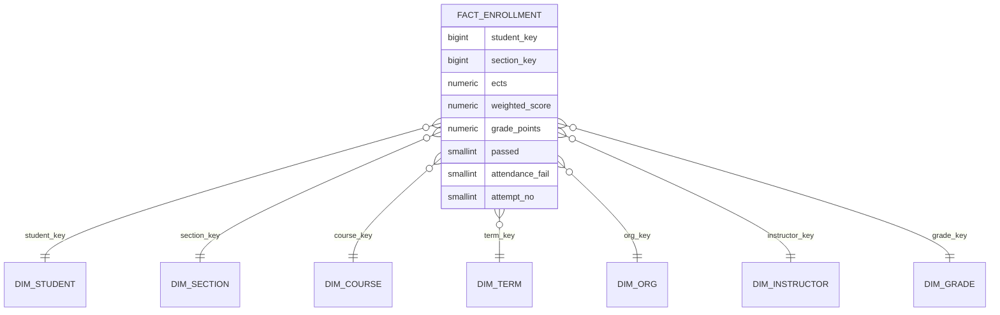

# 05 · Analitik Katman (OLAP)

> **Durum:** Taslak v0.1 · İlgili: [04 · OLTP Veri Modeli](04-veri-modeli-oltp.md)

## 1. Neden ayrı bir analitik katman?

| OLTP (`agora`) | OLAP (`agora_dw`) |
| --- | --- |
| Normalize (3NF), çok sayıda küçük ve hızlı işlem | Denormalize **yıldız şema**, az sayıda büyük tarama |
| Güncel durum | **Tarihçe** (SCD2 ile "o dönem öğrenci hangi sınıftaydı?") |
| Kimlikli veri | **Takma adlı** veri (KVKK) |
| Kayıt dönemi gibi kritik anlarda yük altında | Analitik sorgular OLTP'yi yavaşlatmaz |

## 2. Mimari

**Kararlar**

1. **Ayrı veritabanı** (`agora_dw`), aynı PostgreSQL sunucusunda başlar. Gerektiğinde ayrı sunucuya taşınır. Uygulama rolü DW'ye yazamaz, sadece ETL rolü yazar.
2. **ETL Go ile, açıkça yazılır** (iki bağlantı havuzu: kaynak + hedef). Extract → Transform → Load adımları görünür ve test edilebilir olur. Bu, Go öğrenme hedefiyle de örtüşür (worker, zamanlayıcı, batch insert / `COPY`, transaction, idempotentlik).
3. Üç besleme modu:
   - **Olay tabanlı** (outbox → DW): kayıt hunisi, giriş olayları. Dakikalar içinde güncel.
   - **Artımlı** (watermark: `updated_at` / `id`): notlar, kayıtlar, LMS olayları. Saatlik.
   - **Gece snapshot'ları**: dönem sonu GANO, SCD2 boyut güncellemeleri, risk skoru.
4. Panellerin okuduğu **agregat tablolar** ETL sonunda yenilenir (`REFRESH MATERIALIZED VIEW CONCURRENTLY`).
5. İleri seviye (opsiyonel, Faz 9+): yüksek hacimli `lms.events` için **ClickHouse** ya da **DuckDB**. Önce PostgreSQL'in sınırını ölçelim, sonra karar verelim.

## 3. Takma Adlandırma (Pseudonymization)

- `student_key = HMAC-SHA256(dw_secret, student_id)` → DW'de öğrenci kimliği, adı, numarası **yok**.
- Demografik alanlar kabalaştırılır: cinsiyet, kayıt tipi, giriş yılı, program. Doğum tarihi yerine **yaş grubu**.
- Panellerde **k-anonimlik eşiği**: grup boyutu < 5 ise değer gösterilmez (ör. 3 kişilik şubenin not dağılımı).
- Danışman risk paneli kimlikli veri gerektirir. Bu yüzden DW'den değil, **OLTP'den** kendi öğrencilerini görür. Risk skoru DW'de hesaplanır, OLTP'ye `student_program_id` ile geri yazılır (`enrollment.risk_scores` tablosu, sadece danışman ve fakülte kapsamında okunur).

## 4. Boyutlar (Dimensions)

| Boyut | Grain | Önemli öznitelikler | SCD |
| --- | --- | --- | --- |
| `dim_date` | gün | tarih, gün adı, hafta, ay, akademik yıl, dönem, **dönem haftası**, tatil mi, sınav dönemi mi | statik (üretilmiş) |
| `dim_time_of_day` | dakika | saat, dakika, gün dilimi (sabah/öğle/akşam) | statik |
| `dim_term` | dönem | akademik yıl, dönem türü, başlangıç/bitiş | 1 |
| `dim_org` | program | program, bölüm, fakülte, derece, dil, öğretim türü (hiyerarşi düzleştirilmiş) | **2** |
| `dim_student` | öğrenci × program versiyonu | student_key, program_key, kayıt türü, kayıt tipi, giriş yılı, cinsiyet, yaş grubu, sınıf, statü, `valid_from/valid_to/is_current` | **2** |
| `dim_course` | ders | kod, ad, AKTS, kredi, tür (zorunlu/seçmeli bağlamı olgu tarafında), dil, sahip bölüm | 2 (AKTS değişirse) |
| `dim_section` | şube | ders, dönem, şube kodu, kapasite, öğretim şekli | 1 |
| `dim_instructor` | öğretim elemanı | instructor_key (takma ad), unvan, bölüm | 2 |
| `dim_grade` | harf notu | harf, katsayı, geçti mi, ortalamaya girer mi, F1 mi | statik |
| `dim_assessment_type` | bileşen alt türü | kategori (ara/final/bütünleme), alt tür | statik |
| `dim_activity_type` | LMS etkinlik türü | tür, grup (içerik/değerlendirme/iletişim) | statik |
| `dim_event_type` | olay türü | kayıt olayı, LMS olayı, güvenlik olayı | statik |

## 5. Olgular (Facts)

| Olgu | Grain | Ölçüler | Boyut anahtarları | Besleme |
| --- | --- | --- | --- | --- |
| `fact_enrollment` | öğrenci × şube | ects, kredi, ağırlıklı puan, katsayı, **geçti (0/1)**, F1 (0/1), deneme no, tekrar mı | student, section, course, term, org, instructor, grade | artımlı + not ilanında olay |
| `fact_assessment_score` | öğrenci × bileşen | puan, ağırlık, girmedi (0/1), LMS kaynaklı mı | student, section, assessment_type, date | artımlı |
| `fact_term_standing` | öğrenci × dönem (**periyodik snapshot**) | denenen/kazanılan AKTS, YANO, GANO, kümülatif AKTS, onur/yüksek onur | student, term, org | dönem sonu + not ilanı |
| `fact_registration_event` | kayıt olayı (**işlem**) | 1, sepette toplam AKTS, gönderim/onay süresi (sn) | student, term, org, date, time_of_day, event_type | olay tabanlı |
| `fact_registration_funnel` | öğrenci × dönem (**biriken snapshot**) | ilk ekleme zamanı, gönderim zamanı, onay zamanı, red sayısı, son durum | student, term, org | olay tabanlı |
| `fact_section_capacity_daily` | şube × gün (snapshot) | kapasite, dolu, doluluk %, bekleyen talep | section, date | saatlik/günlük |
| `fact_attendance` | öğrenci × ders oturumu | var (0/1), geç (0/1), mazeretli (0/1) | student, section, date, time_of_day | artımlı |
| `fact_lms_activity_daily` | öğrenci × ders alanı × etkinlik türü × gün | görüntüleme, indirme, gönderim, forum mesajı, sınav denemesi, aktif dakika (tahmini) | student, section, activity_type, date | artımlı (lms.events'ten özet) |
| `fact_submission` | öğrenci × ödev | teslim edildi mi, geç mi, teslimde kalan süre (saat), puan % | student, section, date | artımlı |
| `fact_survey_result` | şube × soru (**sadece agregat**) | yanıt sayısı, ortalama, dağılım | section, instructor, term | anket kapanınca |
| `fact_login_daily` | rol × istemci × gün | tekil kullanıcı, oturum sayısı, başarısız giriş | date, role, client | olay tabanlı |

## 6. Örnek Şema (yıldız): Ders başarısı

## 7. KPI Kataloğu

| KPI | Tanım | Kim görür |
| --- | --- | --- |
| Ders başarı oranı | Σ passed / Σ kayıt (F1 hariç / dahil iki varyant) | Eğitmen (kendi şubeleri), bölüm başkanı, dekan |
| Not dağılımı | harf notu histogramı, ortalama, std sapma, dönemler arası karşılaştırma | Eğitmen, bölüm |
| "Darboğaz" dersler | en düşük başarı oranı + en çok tekrar edilen dersler | Bölüm, dekan |
| Kontenjan doluluğu | dolu/kapasite, ilk X saatte dolan şubeler | Bölüm başkanı |
| Kayıt hunisi | sepet → gönderim → onay dönüşümü, ortalama danışman onay süresi | Fakülte, OİDB |
| Kayıt yük profili | dakika bazında istek/olay (yük testi tasarımına girdi) | Sistem yöneticisi |
| Devamsızlık | şube/öğrenci bazında devamsızlık %, F1 riskindekiler | Eğitmen, danışman |
| LMS etkileşimi | aktif öğrenci %, etkinlik başına etkileşim, **etkileşim ↔ not korelasyonu** | Eğitmen, bölüm |
| Ödev disiplini | zamanında teslim %, son 24 saatte teslim % | Eğitmen |
| Mezuniyet hızı / azami süre | girişten itibaren dönem sayısına göre mezuniyet, azami süreye yaklaşanlar | Fakülte, OİDB |
| GANO dağılımı | program/giriş yılı bazında GANO dağılımı ve eğilimi | Bölüm, dekan |
| Anket sonuçları | soru bazında ortalama (k ≥ 5) | Eğitmen (not ilanından sonra), bölüm |
| Sistem kullanımı | rol bazında günlük aktif kullanıcı, mobil/web oranı | Sistem yöneticisi |

## 8. Erken Uyarı (Risk Skoru) — kural tabanlı v1

Gece çalışan iş, her aktif öğrenci-program için 0–100 arası bir skor hesaplar:

| Sinyal | Ağırlık (başlangıç) | Kaynak |
| --- | --- | --- |
| GANO < 2,00 ya da son iki dönemde düşüş | 25 | fact_term_standing |
| Bu dönem devamsızlık oranı eşiğin %70'ini geçti | 20 | fact_attendance |
| Teslim edilmemiş / geç teslim ödev oranı | 20 | fact_submission |
| Son 14 günde LMS etkileşimi yok | 15 | fact_lms_activity_daily |
| Alttan kalan ders sayısı | 10 | fact_enrollment |
| Azami süreye ≤ 2 dönem kaldı | 10 | dim_student / OLTP |

- Skor ≥ 60 → danışmana bildirim + risk panelinde "yüksek".
- Ağırlıklar `regulation_parameters` benzeri bir yapılandırmada tutulur ve geçmiş dönem verisiyle **geriye dönük test** (backtest) edilerek ayarlanır.
- v2 (opsiyonel): basit lojistik regresyon. Bitirme raporunda "kural tabanlı ve öğrenen model karşılaştırması" bölümü olarak değerlendirilebilir.

## 9. Veri Kalitesi ve Operasyon

- `dw.etl_runs`: job, başlangıç, bitiş, okunan/yazılan satır, watermark, durum, hata. Prometheus metrikleri: `agora_etl_lag_seconds`, `agora_etl_rows_total`, `agora_etl_failures_total`.
- **Mutabakat kontrolleri** (gece): OLTP ve DW kayıt sayıları, şube başına geçme sayısı, GANO yeniden hesap farkı = 0 olmalı. Fark varsa alarm.
- ETL **idempotent**: aynı pencere iki kez çalışırsa sonuç değişmez (doğal anahtar üzerinde `INSERT … ON CONFLICT DO UPDATE`).
- Seed verisi için **geçmiş dönem simülasyonu**: 4–6 yıllık sentetik geçmiş (notlar, devamsızlık, LMS olayları) üretilir. Böylece paneller ve risk modeli anlamlı veriyle çalışır.

## 10. Panel Yerleşimi

| Panel | Araç | Hedef kitle |
| --- | --- | --- |
| Sistem sağlığı (RED, DB, Redis, ETL gecikmesi) | Grafana ← Prometheus | Geliştirici / sistem yöneticisi |
| Yük testi canlı izleme | Grafana ← Prometheus (k6 remote write) | Geliştirici |
| İş analitiği (fakülte/bölüm) | Grafana ← PostgreSQL (`agora_dw`, salt okuma rolü) | Dekanlık / bölüm (demo) |
| Uygulama içi analitik | Agora web ← `/api/v1/analytics/*` (DW agregatları, kapsamlı yetki) | Eğitmen, danışman, bölüm başkanı |
