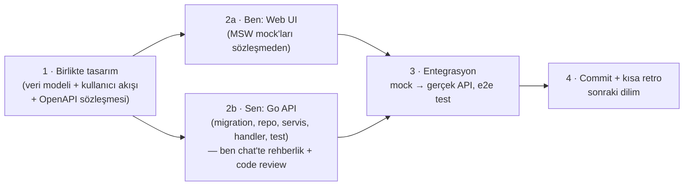

# 07 · Yol Haritası ve Geliştirme Sırası

> **Durum:** Taslak v0.1 · Karar bekleyen konular §5'te.

## 1. Kritik Karar: Önce Backend mi, Frontend mi?

**Kısıtlar**

- Backend kodunu **sen** yazıyorsun (Go öğrenme projesi). Bu yolun **kritik yolu** (critical path) ve en yavaş ilerleyecek kısım burası. Bu bir sorun değil, projenin amacı zaten bu.
- Web ve mobil frontend'i ajan olarak **ben** hızlı üretebilirim.
- Mobil en sona kalacak (karar verildi).

### Seçenekler

| | A) Önce backend (tamamen) | B) Önce frontend (tamamen) | **C) Sözleşme önce, dikey dilimler** |
| --- | --- | --- | --- |
| Nasıl | Tüm API biter, sonra UI | Tüm UI mock'larla biter, sonra API | Her modül için: birlikte veri modeli + OpenAPI sözleşmesi → ben UI'ı mock'la, sen API'yi gerçekle yazarsın → birleştir |
| Görünür ilerleme | Aylarca yok | Çok hızlı | Her dilimde |
| Yeniden iş riski | Düşük (UI'ın ihtiyacı geç fark edilir) | **Yüksek**: hayali API'ye göre UI, sonra uyumsuzluk | Düşük: sözleşme tek kaynak |
| Senin Go temposuna etkisi | Baskı yok ama motivasyon düşebilir | Backend'i UI'a uydurma baskısı | UI bir dilim önde gider, backend kendi temposunda yetişir |
| Tasarım kalitesi | API "veri odaklı" kalır, UX geç düşünülür | UX iyi, API tutarsız olabilir | UX ve API **birlikte** tasarlanır |
| Entegrasyon | Big-bang | Big-bang | Dilim dilim, küçük |

### Öneri: **C — Sözleşme önce, dikey dilimler**

- **Faz 0**'da iki taraf paralel temel atar. Sen: backend iskeleti. Ben: web tasarım sistemi ve uygulama kabuğu.
- Sonra her dilimde UI genellikle **bir dilim önde** olur. Sen bir modülün backend'ini yazarken ben bir sonrakinin UI'ını mock'la hazırlarım. Senin hızın kimseyi bekletmez, kimse de seni sıkıştırmaz.
- **OpenAPI sözleşmesi** (`contracts/openapi.yaml`) Go kodu değil, ortak tasarım belgesidir. Her dilimde ben taslağını çıkarırım, sen incelersin ve birlikte kesinleştiririz. İstersen sözleşmeyi de tamamen sen yazabilirsin, bu bir tercih.
- Her dilimin **"Bitti" tanımı (DoD)**: migration + repository + servis + handler + birim ve entegrasyon testleri + OpenAPI ile uyum + web ekranları + e2e senaryosu + metrikler + doküman güncellemesi + commit.

## 2. Fazlar

> Süreler kaba tahmindir. Bitirme projesinin iki döneme yayıldığı varsayılmıştır (Güz: Graduation Project I, Bahar: II). Kesin teslim tarihlerini öğrendiğimizde takvimi sabitleyeceğiz.

### Faz 0 — Temel (≈ 2 hafta)
| Sen (backend) | Ben (web + ortak) |
| --- | --- |
| `go mod init`, klasör yapısı, `cmd/api` ile `/healthz` | Vite + React + TS + Tailwind + shadcn kurulumu |
| Config struct'ı, `slog`, graceful shutdown | Tasarım sistemi: renkler, tipografi, açık/koyu tema, temel bileşenler |
| `docker compose`: PostgreSQL, Redis, MinIO, Mailpit | Uygulama kabuğu: layout, sidebar, üst bar, program bağlamı seçici, i18n |
| İlk migration + `pgxpool` + `/readyz` | Redux store, RTK Query iskeleti, MSW kurulumu |
| `/metrics` + Prometheus + Grafana (compose'a eklenir) | ESLint/Prettier/Vitest, CI (GitHub Actions) |

**Go konuları:** modüller, paketler, `net/http`, `http.ServeMux` desenleri, middleware, `context`, `log/slog`, `os/signal`, pgx havuzu, migration'lar, `testing` temelleri.

### Faz 1 — IAM + Organizasyon + Seed (≈ 3–4 hafta)
- Giriş, refresh rotasyonu, çıkış, şifre sıfırlama, oturumlar, rate limit, rol/yetki çözümleme, politika iskeleti, denetim izi.
- Organizasyon (fakülte → program, derslik), kişiler, danışman ataması.
- **Seed üretici** (`cmd/seed`): ~92 bin öğrenci, ~10 bin akademisyen, fakülteler, Bilgisayar Mühendisliği müfredatı (gerçek), sentetik diğer programlar.
- Web: giriş, şifre sıfırlama, oturumlarım, profil, rol bazlı menü, kontrol paneli iskeleti.

**Go konuları:** `crypto/ed25519`, `crypto/rand`, `crypto/subtle`, `crypto/hmac`, argon2, **JWT'yi elle yazma**, `encoding/json`/`base64`, Redis, Lua ile rate limit, tablo güdümlü testler, testcontainers.

### Faz 2 — Takvim + Müfredat + Ders Açma (≈ 3 hafta)
- Akademik yıl/dönem, takvim olayları ve **pencere motoru**, müfredat versiyonları, seçmeli gruplar, ön koşullar, not ölçeği, ders açma, şube, kontenjan, haftalık program ve çakışma kontrolü, değerlendirme planı.
- Web: akademik takvim, ders planı (müfredat), ders kataloğu, haftalık program, bölüm başkanı için ders açma ekranları.

**Go konuları:** repository deseni, transaction yardımcısı, cursor sayfalama (generics ile), PostgreSQL range tipleri ve `EXCLUDE` kısıtları, doğrulama.

### Faz 3 — Ders Seçme ★ (≈ 4 hafta, projenin kalbi)
- Program kaydı, alınabilir dersler, sepet, **kural motoru** (AKTS/GANO, 1. sınıf zorunluluğu, alttan ders önceliği, ön koşul, çakışma, kontenjan, engel, azami süre), danışmana gönder/onay/red, outbox → (ileride LMS üyeliği), kayıt onay raporu.
- Danışman ekranı: öğrenci listesi, toplu inceleme, onay/red.
- **İlk k6 senaryosu: `registration-rush`** → kontenjan aşımı = 0 kanıtı.

**Go konuları:** goroutine/channel, `sync`, `errgroup`, **race detector**, advisory lock, koşullu atomik UPDATE, iyimser kilit, idempotentlik, outbox deseni, `pprof`.

### Faz 4 — Değerlendirme ve Not (≈ 3 hafta)
- Bileşen notu girişi (pencere + eğitmen kontrolü), harf notu hesaplama, ilan, sınıf istatistikleri, bütünleme, YANO/GANO, transkript, sanal transkript ("ne olur" simülatörü), not düzeltme talebi.

**Go konuları:** ondalık aritmetik (float yok: tamsayı yüzdelik ya da `pgtype.Numeric`), kural motoru tasarımı, özellik tabanlı (property-based) test fikri, `text/template` ile rapor.

> **Güz dönemi sonu hedefi (Graduation Project I):** Faz 0–4 → giriş yapan öğrenci ders seçer, danışman onaylar, eğitmen not girer, öğrenci transkriptini görür. Çalışan bir dikey MVP + ilk yük testi sonuçları.

### Faz 5 — LMS Çekirdeği (≈ 4 hafta)
- Ders alanı (kayıt onayında otomatik üyelik), bölümler, dosya/klasör/link/sayfa, ödev + teslim + puanlama + geri bildirim, **not öğesi ↔ değerlendirme bileşeni köprüsü**, forum, zaman çizelgesi, ilerleme.

**Go konuları:** multipart upload'u stream etme, `io.Reader`/`Writer` kompozisyonu, S3/MinIO, imzalı URL, HTML temizleme, dosya tipi tespiti.

### Faz 6 — İletişim (≈ 2–3 hafta)
- Duyurular (hedef kitle), bildirim merkezi + tercih matrisi, **SSE** ile canlı bildirim, e-posta (outbox + worker), mesajlaşma.

**Go konuları:** SSE (`http.Flusher`), Redis pub/sub, worker pool, `net/smtp`, `html/template`, üstel geri çekilme.

### Faz 7 — Yoklama, Sınav (quiz), Anket, Belgeler (≈ 4 hafta)
- Yoklama oturumları ve girişi, quiz ve soru bankası, anonim ders değerlendirme anketi + anket kapısı, belge üretimi (PDF) + imza + doğrulama kodu/QR + halka açık doğrulama sayfası.

**Go konuları:** zaman ve takvim hesapları, JSONB ile esnek modeller, PDF üretimi, imzalama, QR üretimi.

### Faz 8 — Analitik / OLAP (≈ 3 hafta)
- `agora_dw`, boyutlar ve olgular, ETL worker'ı, sentetik geçmiş dönem verisi, Grafana iş panelleri, uygulama içi analitik, risk skoru ve danışman risk paneli.

**Go konuları:** batch işleme, `COPY` protokolü, zamanlanmış işler, idempotent upsert, iki veritabanıyla çalışma.

### Faz 9 — Sertleştirme ve Performans (≈ 3 hafta)
- Tüm k6 senaryoları, darboğaz analizi (`pg_stat_statements`, pprof), önbellekleme, index iyileştirme, güvenlik taraması (ZAP, gosec, govulncheck, Trivy), ASVS kontrol listesi, (opsiyonel) RLS, (opsiyonel) OpenTelemetry tracing, SLO panosu.

**Go konuları:** benchmark'lar, kaçış analizi (escape analysis), `sync.Pool`, profil okuma, bellek ve GC ayarı.

### Faz 10 — Mobil (≈ 4 hafta)
- Expo uygulaması: giriş (secure store), kontrol paneli, ders programı, notlar/transkript, LMS içerik ve ödev teslimi, bildirimler (push), QR yoklama (P2).

### Faz 11 — Dağıtım, Dokümantasyon, Teslim (≈ 2 hafta)
- VPS + Docker Compose + Caddy, demo verisi, kullanım kılavuzu, mimari doküman güncellemesi, bitirme raporu, sunum.

## 3. İlk Somut Adımlar (karar sonrası)

1. Sen kararları verirsin (§5).
2. Ben: `docs/` dokümanlarını kararlarına göre güncellerim. Kökte `docker-compose.yml` iskeleti ve `contracts/openapi.yaml` iskeleti hazırlarım. Backend klasörüne **dokunmam**.
3. Sen: Faz 0 backend'ine başlarsın. İlk dersimiz Go modül yapısı, `net/http` ve Spring'deki karşılıkları. Kodu ben chat'te adım adım açıklarım, sen yazarsın.
4. Ben paralelde: web iskeleti + tasarım sistemi + uygulama kabuğu.

## 4. Çalışma Kuralları (özet)

- Her küçük başarıdan sonra Türkçe, önek kullanmayan commit, yazar CAPELLAX02.
- `backend/` altına sadece sen yazarsın. Ben backend kodunu chat'te gösteririm ve istersen code review yaparım.
- Her dilim sonunda doküman ve sözleşme güncellenir.

## 5. Senin Kararını Bekleyen Konular

| # | Soru | Önerim |
| --- | --- | --- |
| 1 | Geliştirme sırası: A, B ya da C? | **C** |
| 2 | OpenAPI sözleşmesini kim yazsın? (taslak ben + inceleme sen / tamamen sen) | Taslak ben, karar sen |
| 3 | Ortak paketler (`packages/api-types`, `packages/i18n`) + pnpm workspaces eklensin mi? | Evet (mobil fazında değer kazanır) |
| 4 | Migration aracı: goose / golang-migrate / kendi migrator'ımız? | goose (düz SQL, Go API'si de var) |
| 5 | JWT: elle (stdlib Ed25519) mi, kütüphane mi? | Elle + kapsamlı testler (öğrenme değeri yüksek) |
| 6 | SQL: elle pgx mi, sqlc (koddan üretim) mi? | Önce elle pgx. sqlc'yi Faz 9'da karşılaştırma olarak deneyebiliriz |
| 7 | Kapsama ek kampüs yaşamı özellikleri (yemekhane menüsü, ring saatleri, etkinlik/kulüp) "Agora" adına uygun P2 olarak eklensin mi? | Opsiyonel P2 |
| 8 | Bitirme projesi teslim takvimi (ara rapor, final, sunum tarihleri) nedir? | Takvimi buna göre sabitleyelim |
| 9 | Seed'de Bilgisayar Mühendisliği'nin gerçek (halka açık) ders planını kullanalım mı? | Evet |
