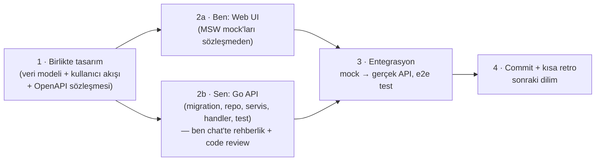

# 07 · Yol Haritası ve Geliştirme Sırası

> **Durum:** v0.3 · Kararlar §5'te · İlerleme ve "Bitti" kontrol listesi §6'da.

## 1. Kritik Karar: Önce Backend mi, Frontend mi?

**Kısıtlar**

- Backend kodunu **sen** yazıyorsun (Go öğrenme projesi). Bu yolun **kritik yolu** (critical path) ve en yavaş ilerleyecek kısım burası. Bu bir sorun değil, projenin amacı zaten bu.
  - *Güncelleme (2026-10-08):* Go temelleri Ders 1–17'de atıldı. Bundan sonra kodun tamamını Claude yazıyor, Ahmet her dilimde inceliyor (bkz. §4 ve §5 #10).
- Web ve mobil frontend'i ajan olarak **ben** hızlı üretebilirim.
- Mobil en sona kalacak (karar verildi).

### Seçenekler

| | A) Önce backend (tamamen) | B) Önce frontend (tamamen) | **C) Sözleşme önce, dikey dilimler** |
| --- | --- | --- | --- |
| Nasıl | Tüm API biter, sonra UI | Tüm UI mock'larla biter, sonra API | Her modül için: birlikte veri modeli + OpenAPI sözleşmesi → ben UI'ı mock'la, sen API'yi gerçekle yazarsın → birleştir |
| Görünür ilerleme | Aylarca yok | Çok hızlı | Her dilimde |
| Yeniden iş riski | Düşük (UI'ın ihtiyacı geç fark edilir) | **Yüksek**: hayali API'ye göre UI, sonra uyumsuzluk | Düşük: sözleşme tek kaynak |
| Senin Go temposuna etkisi | Baskı yok ama motivasyon düşebilir | Backend'i UI'a uydurma baskısı | UI bir dilim önde gider, backend kendi temposunda yetişir |
| Tasarım kalitesi | API "veri odaklı" kalır, UX geç düşünülür | UX iyi, API tutarsız olabilir | UX ve API **birlikte** tasarlanır |
| Entegrasyon | Big-bang | Big-bang | Dilim dilim, küçük |

### Öneri: **C — Sözleşme önce, dikey dilimler**

- **Faz 0**'da iki taraf paralel temel atar. Sen: backend iskeleti. Ben: web tasarım sistemi ve uygulama kabuğu.
- Sonra her dilimde UI genellikle **bir dilim önde** olur. Sen bir modülün backend'ini yazarken ben bir sonrakinin UI'ını mock'la hazırlarım. Senin hızın kimseyi bekletmez, kimse de seni sıkıştırmaz.
- **OpenAPI sözleşmesi** (`contracts/openapi.yaml`) Go kodu değil, ortak tasarım belgesidir. Her dilimde ben taslağını çıkarırım, sen incelersin ve birlikte kesinleştiririz. İstersen sözleşmeyi de tamamen sen yazabilirsin, bu bir tercih.
- Her dilimin **"Bitti" tanımı (DoD)**: migration + repository + servis + handler + birim ve entegrasyon testleri + OpenAPI ile uyum + web ekranları + e2e senaryosu + metrikler + doküman güncellemesi + commit.

## 2. Fazlar

> Süreler kaba tahmindir. Bitirme projesinin iki döneme yayıldığı varsayılmıştır (Güz: Graduation Project I, Bahar: II). Kesin teslim tarihlerini öğrendiğimizde takvimi sabitleyeceğiz.

### Faz 0 — Temel (≈ 2 hafta)
| Sen (backend) | Ben (web + ortak) |
| --- | --- |
| `go mod init`, klasör yapısı, `cmd/api` ile `/healthz` | Vite + React + TS + Tailwind + shadcn kurulumu |
| Config struct'ı, `slog`, graceful shutdown | Tasarım sistemi: renkler, tipografi, açık/koyu tema, temel bileşenler |
| `docker compose`: PostgreSQL, Redis, MinIO, Mailpit | Uygulama kabuğu: layout, sidebar, üst bar, program bağlamı seçici, i18n |
| İlk migration + `pgxpool` + `/readyz` | Redux store, RTK Query iskeleti, MSW kurulumu |
| `/metrics` + Prometheus + Grafana (compose'a eklenir) | ESLint/Prettier/Vitest, CI (GitHub Actions) |

**Go konuları:** modüller, paketler, `net/http`, `http.ServeMux` desenleri, middleware, `context`, `log/slog`, `os/signal`, pgx havuzu, migration'lar, `testing` temelleri.

### Faz 1 — IAM + Organizasyon + Seed (≈ 3–4 hafta)
- Giriş, refresh rotasyonu, çıkış, şifre sıfırlama, oturumlar, rate limit, rol/yetki çözümleme, politika iskeleti, denetim izi.
- Organizasyon (fakülte → program, derslik), kişiler, danışman ataması.
- **Seed üretici** (`cmd/seed`): ~92 bin öğrenci, ~10 bin akademisyen, fakülteler, Bilgisayar Mühendisliği müfredatı (gerçek), sentetik diğer programlar.
- Web: giriş, şifre sıfırlama, oturumlarım, profil, rol bazlı menü, kontrol paneli iskeleti.

**Go konuları:** `crypto/ed25519`, `crypto/rand`, `crypto/subtle`, `crypto/hmac`, argon2, **JWT'yi elle yazma**, `encoding/json`/`base64`, Redis, Lua ile rate limit, tablo güdümlü testler, testcontainers.

### Faz 2 — Takvim + Müfredat + Ders Açma (≈ 3 hafta)
- Akademik yıl/dönem, takvim olayları ve **pencere motoru**, müfredat versiyonları, seçmeli gruplar, ön koşullar, not ölçeği, ders açma, şube, kontenjan, haftalık program ve çakışma kontrolü, değerlendirme planı.
- Web: akademik takvim, ders planı (müfredat), ders kataloğu, haftalık program, bölüm başkanı için ders açma ekranları.

**Go konuları:** repository deseni, transaction yardımcısı, cursor sayfalama (generics ile), PostgreSQL range tipleri ve `EXCLUDE` kısıtları, doğrulama.

### Faz 3 — Ders Seçme ★ (≈ 4 hafta, projenin kalbi)
- Program kaydı, alınabilir dersler, sepet, **kural motoru** (AKTS/GANO, 1. sınıf zorunluluğu, alttan ders önceliği, ön koşul, çakışma, kontenjan, engel, azami süre), danışmana gönder/onay/red, outbox → (ileride LMS üyeliği), kayıt onay raporu.
- Danışman ekranı: öğrenci listesi, toplu inceleme, onay/red.
- **İlk k6 senaryosu: `registration-rush`** → kontenjan aşımı = 0 kanıtı.

**Go konuları:** goroutine/channel, `sync`, `errgroup`, **race detector**, advisory lock, koşullu atomik UPDATE, iyimser kilit, idempotentlik, outbox deseni, `pprof`.

### Faz 4 — Değerlendirme ve Not (≈ 3 hafta)
- Bileşen notu girişi (pencere + eğitmen kontrolü), harf notu hesaplama, ilan, sınıf istatistikleri, bütünleme, YANO/GANO, transkript, sanal transkript ("ne olur" simülatörü), not düzeltme talebi.

**Go konuları:** ondalık aritmetik (float yok: tamsayı yüzdelik ya da `pgtype.Numeric`), kural motoru tasarımı, özellik tabanlı (property-based) test fikri, `text/template` ile rapor.

> **Güz dönemi sonu hedefi (Graduation Project I):** Faz 0–4 → giriş yapan öğrenci ders seçer, danışman onaylar, eğitmen not girer, öğrenci transkriptini görür. Çalışan bir dikey MVP + ilk yük testi sonuçları.

### Faz 5 — LMS Çekirdeği (≈ 4 hafta)
- Ders alanı (kayıt onayında otomatik üyelik), bölümler, dosya/klasör/link/sayfa, ödev + teslim + puanlama + geri bildirim, **not öğesi ↔ değerlendirme bileşeni köprüsü**, forum, zaman çizelgesi, ilerleme.

**Go konuları:** multipart upload'u stream etme, `io.Reader`/`Writer` kompozisyonu, S3/MinIO, imzalı URL, HTML temizleme, dosya tipi tespiti.

### Faz 6 — İletişim (≈ 2–3 hafta)
- Duyurular (hedef kitle), bildirim merkezi + tercih matrisi, **SSE** ile canlı bildirim, e-posta (outbox + worker), mesajlaşma.

**Go konuları:** SSE (`http.Flusher`), Redis pub/sub, worker pool, `net/smtp`, `html/template`, üstel geri çekilme.

### Faz 7 — Yoklama, Sınav (quiz), Anket, Belgeler (≈ 4 hafta)
- Yoklama oturumları ve girişi, quiz ve soru bankası, anonim ders değerlendirme anketi + anket kapısı, belge üretimi (PDF) + imza + doğrulama kodu/QR + halka açık doğrulama sayfası.

**Go konuları:** zaman ve takvim hesapları, JSONB ile esnek modeller, PDF üretimi, imzalama, QR üretimi.

### Faz 8 — Analitik / OLAP (≈ 3 hafta)
- `agora_dw`, boyutlar ve olgular, ETL worker'ı, sentetik geçmiş dönem verisi, Grafana iş panelleri, uygulama içi analitik, risk skoru ve danışman risk paneli.

**Go konuları:** batch işleme, `COPY` protokolü, zamanlanmış işler, idempotent upsert, iki veritabanıyla çalışma.

### Faz 9 — Sertleştirme ve Performans (≈ 3 hafta)
- Tüm k6 senaryoları, darboğaz analizi (`pg_stat_statements`, pprof), önbellekleme, index iyileştirme, güvenlik taraması (ZAP, gosec, govulncheck, Trivy), ASVS kontrol listesi, (opsiyonel) RLS, (opsiyonel) OpenTelemetry tracing, SLO panosu.

**Go konuları:** benchmark'lar, kaçış analizi (escape analysis), `sync.Pool`, profil okuma, bellek ve GC ayarı.

### Faz 10 — Mobil (≈ 4 hafta)
- Expo uygulaması: giriş (secure store), kontrol paneli, ders programı, notlar/transkript, LMS içerik ve ödev teslimi, bildirimler (push), QR yoklama (P2).

### Faz 11 — Dağıtım, Dokümantasyon, Teslim (≈ 2 hafta)
- VPS + Docker Compose + Caddy, demo verisi, kullanım kılavuzu, mimari doküman güncellemesi, bitirme raporu, sunum.

## 3. İlk Somut Adımlar (karar sonrası)

1. Sen kararları verirsin (§5).
2. Ben: `docs/` dokümanlarını kararlarına göre güncellerim. Kökte `docker-compose.yml` iskeleti ve `contracts/openapi.yaml` iskeleti hazırlarım. Backend klasörüne **dokunmam**.
3. Sen: Faz 0 backend'ine başlarsın. İlk dersimiz Go modül yapısı, `net/http` ve Spring'deki karşılıkları. Kodu ben chat'te adım adım açıklarım, sen yazarsın.
4. Ben paralelde: web iskeleti + tasarım sistemi + uygulama kabuğu.

## 4. Çalışma Kuralları (özet)

- Her küçük başarıdan sonra Türkçe, önek kullanmayan commit, yazar CAPELLAX02. Her commit'ten önce `make check` (ve web'de karşılığı) yeşil olmalı.
- Ders 17'ye kadar `backend/` kodunu Ahmet yazdı. Ders 17'den sonra bütün kodu Claude yazar. Ahmet her dilim sonunda inceler, "devam" demeden sonraki dilime geçilmez.
- **Bir faz tamamen bitmeden sonrakine geçilmez:** önce o fazın backend'i eksiksiz (sözleşme, migration, servis, uç, test), sonra web ekranları, sonra uçtan uca testler ve doküman. §6'daki kontrol listesinin bütün maddeleri işaretlenince faz kapanır.
- Her dilimde sözleşme koddan **önce** güncellenir. Doküman ve kontrol listesi aynı commit dizisinde güncellenir.

## 5. Kararlar (2026-10-05)

| # | Konu | Karar |
| --- | --- | --- |
| 1 | Geliştirme sırası | **C — sözleşme önce, dikey dilimler**. Başlangıçta Go temelleri ağırdan alınır, backend temeli önce atılır |
| 2 | OpenAPI sözleşmesi | Taslak Claude, inceleme ve son karar Ahmet |
| 3 | Ortak paketler (`packages/api-types`, `packages/i18n`) | Evet, pnpm workspaces ile (ihtiyaç doğduğunda) |
| 4 | Migration aracı | goose (düz SQL) |
| 5 | JWT | Stdlib Ed25519 ile elle + kapsamlı testler |
| 6 | SQL erişimi | Elle yazılmış SQL + pgx. sqlc Faz 9'da karşılaştırma olarak denenebilir |
| 7 | Kampüs yaşamı özellikleri | Opsiyonel P2 |
| 8 | Teslim takvimi | **Açık**. Tarihler öğrenilince fazlar sabitlenecek |
| 9 | Seed müfredatı | Bilgisayar Mühendisliği'nin halka açık gerçek ders planı kullanılacak |
| 10 | Kodu kim yazar (2026-10-08) | Ders 17'ye kadar backend'i Ahmet yazdı. Bundan sonra bütün kodu Claude yazar, Ahmet dilim sonlarında inceler |
| 11 | Faz kapanışı (2026-10-08) | Bir faz, §6'daki bütün maddeleri (backend + web + e2e + doküman) bitmeden kapanmaz. Backend'i bitmemiş bir fazın web'ine geçilmez |

## 6. İlerleme ve "Bitti" Kontrol Listesi

> Her commit'te ilgili madde işaretlenir. ✅ bitti · 🔄 sürüyor · ⬜ başlanmadı · ⏭️ bilinçli olarak sonraki faza taşındı (gerekçesiyle).

### Faz 0 — Temel

| Durum | Madde | Not |
| --- | --- | --- |
| ✅ | Go modülü, klasör yapısı, `/healthz`, config, `slog`, graceful shutdown | Ders 1–5 |
| ✅ | PostgreSQL + `pgxpool` + `/readyz`, goose migration'ları | Ders 6–9 |
| ✅ | `/metrics`, Prometheus, Grafana (panolar kod olarak) | Ders 11–12 |
| ✅ | Backend CI (gofmt, vet, staticcheck, govulncheck, race testleri) | |
| ✅ | Redis | Ders 16 |
| ✅ | Mailpit (geliştirme SMTP) | `http://localhost:8025` |
| ⏭️ | MinIO | Faz 5'te dosya yüklemeyle birlikte eklenecek: kullanılmayan servis compose'da durmasın |
| ✅ | Web: Vite + React + TS + Tailwind + shadcn, ESLint/Prettier/Vitest | pnpm (corepack), TypeScript strict, tip bilgili ESLint |
| ✅ | Web: tasarım sistemi, açık/koyu tema, uygulama kabuğu, i18n | Radix tabanlı bileşenler, OKLCH renk belirteçleri, TR/EN (anahtarlar tip kontrollü, iki dilin eşliği testli) |
| ✅ | Web: Redux store, OpenAPI'den RTK Query istemcisi, MSW | Access token sadece bellekte, 401'de tek uçuşlu sessiz yenileme, MSW ile bütünleşik testler |
| ✅ | Web CI | Biçim, lint, tip, test, build; üretilmiş istemcinin sözleşmeyle uyumu |

### Faz 1 — IAM + Organizasyon + Seed

**Backend**

| Durum | Madde | Not |
| --- | --- | --- |
| ✅ | Parola hash'leme (argon2id) ve parola politikası | Ders 10 |
| ✅ | JWT (Ed25519) elle | Ders 12 |
| ✅ | Giriş, refresh rotasyonu ve yeniden kullanım tespiti, çıkış | Ders 14–15 |
| ✅ | Hesap kilitleme, giriş hız sınırı, anında oturum iptali | Ders 14, 16 |
| ✅ | Rol/yetki çözümleme, politikalı router (varsayılan ret), sürümlü yetki önbelleği | Ders 17 |
| ✅ | Güvenlik başlıkları ve CORS | Sıkı CSP, nosniff, HSTS (HTTPS ortamlarında), origin listesiyle CORS |
| ✅ | Denetim izi (`audit.audit_log`) ve güvenlik olayları (`audit.security_events`), aylık partition | Giriş, çıkış, kilit ve yeniden kullanım olayları; `GET /audit/log`, `GET /audit/security-events`. Saklama süresine göre arşivleme worker'la, `INSERT`-only DB rolü Faz 9'da |
| ✅ | Parola değiştirme, `must_change_password` zorunluluğu | `POST /me/password`, `SelfService` politikası, diğer oturumlar kapanır, yanlış mevcut parola kilit sayacını artırır |
| ✅ | E-posta outbox'ı ve `cmd/worker` (SMTP, üstel geri çekilme) | `SKIP LOCKED` + kira ile çoklu worker, gönderimden sonra gizli veri silinir, `agora_outbox_*` metrikleri, günlük bakım işi |
| ✅ | Şifre sıfırlama (30 dk, tek kullanımlık token, bütün oturumlar iptal) | `forgot` her zaman 202, hesap başına 2 dk kısma, IP hız sınırı, token URL parçasında (#), `FOR UPDATE` ile tek kullanım, PENDING hesap etkinleşir |
| ✅ | Oturumlarım: listeleme, tek oturumu kapatma, diğer oturumları kapatma | Cihaz bilgisi User-Agent'tan, kapatılan oturumların access token'ları anında geçersiz, `GET /me/security-events` ile giriş geçmişi |
| ✅ | Kullanıcı yönetimi: listeleme, oluşturma (aktivasyon e-postasıyla), askıya alma | Hesap PENDING başlar, parolayı kullanıcı belirler; askıya almada oturumlar anında kapanır; kendi hesabında işlem yasak; denetim kaydı |
| ✅ | Rol kataloğu, rol atama ve sonlandırma (görevler ayrılığı, denetim izi) | Kendine rol atanamaz, kapsam doğrulaması, ileri tarihli atama, son sistem yöneticisi korunur (advisory lock + `clock_timestamp()`), değişiklik anında etkili |
| ✅ | Organizasyon: binalar ve derslikler | Kapsamlı yetki (binanın birimi), iyimser kilit (ETag/If-Match, 412/428), denetim kaydı, geliştirme seed'i |
| ✅ | Program kaydı (`enrollment.student_programs`) ve danışman ataması | Yetkili kümeden listeleme, danışman rolü ilişkiye dayalı (bölümü kapsamaz), erişim yoksa 404, danışman geçmişi. Müfredat/dönem bağlantıları Faz 2'de |
| ✅ | İş metrikleri (`agora_login_failures_total`, `agora_refresh_reuse_detected_total` …) | Girişler, başarısız girişler (sebebe göre), kilitlenmeler, token yeniden kullanımı, parola sıfırlama, hız sınırı; Grafana'da "Kimlik doğrulama ve güvenlik" ve "Worker" satırları |
| ✅ | Seed üretici: ~92 bin öğrenci, ~10 bin personel, sentetik programlar, danışmanlar | `make seed-synthetic` (~6 sn, COPY + tek transaction, belirlenimci tohum); 68 programlık katalog; arama için trigram index'leri (75 ms → 0,7 ms). Gerçek BM müfredatı Faz 2'de müfredat modeliyle |
| ✅ | MFA (TOTP) ve kurtarma kodları | RFC 6238 (resmi test vektörleriyle), sır AES-256-GCM ile şifreli ve kullanıcıya bağlı, tekrar oynatma koruması, iki adımlı giriş (5 dk, 5 deneme, ortak kilit sayacı), 10 kurtarma kodu (HMAC), hassas yetkiler sadece MFA'lı oturumda (`403 MFA_REQUIRED`), yönetici sıfırlaması |

**Web**

| Durum | Madde |
| --- | --- |
| ✅ | Giriş, oturum geri yükleme (sessiz refresh), çıkış |
| ✅ | Parola değiştirme (ilk girişte zorunlu), şifre sıfırlama ve hesap aktivasyonu |
| ✅ | İki adımlı doğrulama: girişin ikinci adımı, kurulum (QR), kurtarma kodları, MFA öneri bandı |
| ✅ | Oturumlarım, güvenlik geçmişi, profil |
| ✅ | Rol bazlı menü, kontrol paneli iskeleti |
| ✅ | Yönetim: kullanıcılar, hesap işlemleri, rol atama, MFA sıfırlama, denetim kayıtları |

**Kapanış**

| Durum | Madde |
| --- | --- |
| ✅ | Playwright e2e: giriş, ilk girişte parola değiştirme, şifre sıfırlama, MFA kurulumu ve iki adımlı giriş, rol atamasının anında etkisi, hesap aktivasyonu (gerçek yığınla, CI'da da) |
| ✅ | Sözleşme ve dokümanlar güncel, CI yeşil. Go 1.27.2'ye geçildi (net/http HTTP/2 açıkları GO-2026-6611/6612/6613/6617); staticcheck ve govulncheck `backend/tools` modülünde sabitlendi |

### Faz 2 — Takvim + Müfredat + Ders Açma

**Backend**

| Durum | Madde | Not |
| --- | --- | --- |
| ✅ | Akademik yıl ve dönemler, tek aktif dönem | `academic.academic_years`, `academic.terms`, kısmi benzersiz index ile tek aktif dönem; yıl ve dönem tanımı üniversite geneli yetki ister |
| ✅ | Takvim olayları ve pencere motoru | Tipli zaman pencereleri, kapsam (üniversite → fakülte → program) geçersiz kılma, aynı kapsamda çakışma yok (`EXCLUDE`), taslak olaylar, `GET /calendar/windows` |
| ✅ | Ders kataloğu, ön koşullar (VE/VEYA grupları), eşdeğerlikler | `curriculum.courses`; kod sabit (değişen ders yeni kodla açılıp eşdeğerlikle bağlanır), ön koşul kümesi tek seferde değişir, döngü özyinelemeli sorguyla engellenir (`PREREQUISITE_CYCLE`), eski ↔ yeni kod eşdeğerliği; bölüm kapsamlı yetki |
| ✅ | Seçmeli gruplar ve ders havuzları | Teknik seçmeli, üniversite alan dışı, pedagojik formasyon, genel sosyal; havuz üyeliği idempotent `PUT` |
| ✅ | Versiyonlu müfredat ve öğrenci program kaydına bağlantı | Taslak → yürürlükte → arşiv; yürürlükteki sürümlerin giriş yılları çakışamaz (`EXCLUDE`); yürürlüğe girerken AKTS toplamı ve yarıyıl sınırı doğrulanır, aralıktaki öğrenci kayıtları bağlanır; ders satırı ve seçmeli yuva; `GET /me/curricula` |
| ✅ | Not ölçeği ve yönetmelik parametreleri (veri olarak) | Ankara Üniversitesi lisans ölçeği (A … F2, F1 devamsızlık, BŞR/BŞZ, MUAF); puan aralıkları 0-100'ü boşluksuz kapsar (`EXCLUDE` + doğrulama), tek varsayılan ölçek; parametreler tarihli (`daterange` çakışmasız), yeni değer eskisini kapatır, JSON türü korunur |
| ✅ | Ders açma, şube, kontenjan ve program bazlı alt kontenjan, öğretim elemanı ataması | Bir ders dönemde bir kez açılır, öğrenci grupları şubelerle; durum geçişleri (planlama → açık → kapalı, iptal); kontenjan kayıtlı sayının ve program kontenjanları toplamının altına inemez (`CHECK`); tek sorumlu öğretim elemanı (kısmi benzersiz index), sadece görevdeki akademik personel; bölüm kapsamlı yetki |
| ✅ | Haftalık program ve çakışma kontrolü | `timerange` tipi; derslik ve şube içi çakışma veritabanında (`EXCLUDE`), öğretim elemanı çakışması serviste (dönem başına advisory lock ile yarışsız); teorik oturumda derslik kapasitesi; çakışma mesajı dersi ve saati söyler; bölüm, derslik ve öğretim elemanı programı, `GET /me/teaching` |
| ✅ | Değerlendirme planı | `grading` şeması; bileşenler ve ağırlıklar (dönem içi + final = 100, tek final), bütünleme finalden türetilir; bileşen kimlikleri yeniden yazmada korunur (notlar bağlanacak); düzenleme ilişkiye dayalı (şubenin öğretim elemanı) ya da bölüm; kilidi öğretim elemanı koyar, gerekçeyle bölüm açar |
| ⬜ | Seed: gerçek BM (İngilizce) müfredatı, 2026-2027 takvimi, not ölçeği, BM güz dönemi ders açma ve programı | Müfredat bölümün yayımladığı formlardan (2022, 2023, 2026 sürümleri) |

**Web**

| Durum | Madde |
| --- | --- |
| ⬜ | Akademik takvim: dönem seçici, açık/kapalı pencereler, olay yönetimi |
| ⬜ | Ders kataloğu ve ders detayı (ön koşul, eşdeğerlik, havuzlar) |
| ⬜ | Ders planı (müfredat): öğrenci için kendi programı (program bağlamı seçici), personel için program ve sürüm gezgini, taslak düzenleme |
| ⬜ | Haftalık program görünümü (öğretim elemanı, bölüm, derslik) |
| ⬜ | Ders açma ekranları (bölüm başkanı): ders açma, şube, kontenjan, öğretim elemanı, program yerleşimi ve çakışma geri bildirimi |
| ⬜ | Değerlendirme planı (öğretim elemanı) ve not ölçeği |

**Kapanış**

| Durum | Madde |
| --- | --- |
| ⬜ | Playwright e2e: takvim penceresi, müfredat görüntüleme, ders açma ve çakışma senaryoları |
| ⬜ | Sözleşme ve dokümanlar güncel, CI yeşil |

### Faz 2 ve sonrası

Her faz başlarken §2'deki kapsamdan aynı biçimde ayrıntılı bir liste çıkarılır.
